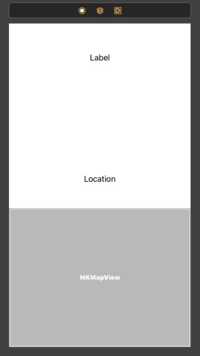
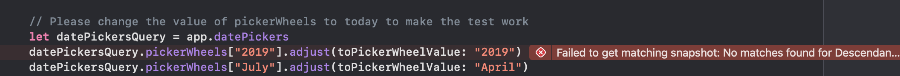

# Swifts-30-Projects - 04

이번에는 MVC 패턴으로 (Views, Models, ViewControllers)로 나뉘어져 있고, Unit Test, UI Test 또한 존재한다. 설명을 보면 TDD로 개발이 이루어졌다고 써있다.

---

# Views

## ItemCell

홈 화면의 tableView에서 사용할 cell을 담당한다. 

3개의 `UILabel` 을 가지고 있다.

`**dataFormatter**` 

기본 DataFormatter에서 날짜 형식을 지정하였다. 클래스를 선언 시에 클로저로 묶어서 선언한 것을 볼 수 있다.

`**setSelected**` 

메서드에서는 선택되었을 때 애니메이션 사용 여부를 설정한다.

`**configCell(with:,isChecked:)`** 

셀을 설정한다. TodoItem, Bool 타입 데이터를 인자로 받아 값을 셀을 설정한다.

configCell에서, `NSAttributedString` 타입의 인스턴스를 생성한다. `NSAttributedString`? 이게뭐지.. 했다. 정말 코드를 볼때마다 매번 새로운게 나온다..

`NSAttributedString` 은 `NSString`(text) + `Dictionary`(attributes)로 이루어져 있다.

attributes에 속성들을 설정해준다. 일부 글자의 속성도 변경 가능. 

configCell에서 cell의 `UILabel` 들과 텍스트에 밑줄긋는 속성을 설정하였다.

## ItemListViewController

홈 화면에서 `talbeView`를 포함하고 있는 `ViewController`이다. 

`**viewDidLoad()**`

tableView에서 필요한 `dataSource`, `delegate`는 `ItemListDataProvider` 타입의 `dataProvider` 에게 위임 되었다.

```swift
NotificationCenter.default.addObserver(self, selector: #selector(showDetails(_:)), name: Notification.ItemSelectedNotification, object: nil)
```

Notificiation 패턴을 이용하여 옵저버를 등록한다. (ItemSelectedNotification)을 post한 다른 Notificiaton으로 부터 데이터를 수신할 것.

**`viewWillAppear(_:)`**

`viewDidLoad()` 수행 이후 동작하는 `UIViewController`의 Life Cycle이다. view가 화면에 표시되기 직전에 수행된다.  이때는 tableView를 reload한다.

`**@objc func showDetails(_:)**`

위 Notification 패턴에서 사용한 옵저버에서 수행할 메서드이다. 전달받은 `Notification` 의 `userInfo` 를 이용해 새로운 화면을 표시한다.

`**@IBAction func addItem(_ sender: UIBarButtonItem)**`

네비게이션 버튼을 클릭시 이벤트를 정의하는 메서드이다.

`inputViewController`를 storyboard에서 가져와, `itemManger`를 할당한 채로 `present` 메서드를 수행한다.

present 하였으므로 modally로 보여줄 것이다.

tableView 구현을 다른 클래스에 할당하니, 가독성도 좋고 훨씬 정돈된 것 같다. 

## ItemListDataProvider

위 `ItemListViewController.tableView` 의 구현을 담당한 클래스이다.

`ToDoItem` 모두 관리하는 `ToDoItemManager` 클래스를 프로퍼티로 갖고 있다.

각 section별 row의 개수를 반환하는 `tableView(_:,numberOfRowsInSection:)`,

각 row별 셀의 데이터 및 모양을 조정하는 `tableView(_:, cellForRowAt:)` 둘다 `itemManager`에 데이터를 가져와 표시하게된다.

cell을 설정할때도, cell`.configCell(with:)` 메서드를 이용해서 셀을 설정한다. 

`tableView(_:titleForDeleteConfirmationButtonForRowAt:)` 메서드를 사용해 셀을 오른쪽으로 스와이프 했을 때 표시할 문자열을 설정할 수 있음. 반환 값은 문자열인데, toDo일때와 done일때, 다른 문자열이 표시되도록 한다.

`tableView(_:,commit:,forRowAt:)` 

해당 메서드는 편집 모드에서 Delete 버튼을 누르면 호출된다.. 해당 메서드를 추가하는 것 만으로도 셀을 스와이프 하면 Delete버튼이 표시된다.

`tableView(_:,didSelectRowAt:)` 

각 셀을 선택했을 때의 이벤트를 설정한다. toDo 섹션일 경우 Notification 패턴을 통해 `userInfo`에 `indexPath.row` 를 담아 보낸다. 

Notification을 사용한 이유는 `ItemListDataProvider` 는 `NSObject` 이기 때문에 ViewController와도, navigation stack과도 관련이 없다. 하여 notificiation pattern을 통해서 데이터를  ViewController로 전달하고 ViewController에서는 전달받은 데이터를 이용하여 적절한 이벤트를 처리한다.

```swift
NotificationCenter.default.post(
        name: Notification.ItemSelectedNotification,
        object: self,
        userInfo: ["index": indexPath.row])
```

이곳에서 `NotificiationCenter.deafult.post` 를 통해 `ItemListViewController.showDetails(_:)` 가 데이터를 전달받고 ViewController를 push하였다.

## DetailViewController

`ItemListViewController` 에서 tableView의 셀을 선택하면 표시되는 ViewController이다.

각 UILabel에 텍스트를 설정한다. 

스토리보드를 확인하며 `UILabel` , `MKMapView` 를 설정한다.

`MKMapView`는 MapKit에서 맵을 보여주기 위한 `UIView`이다.

`centerMapOnLocation(with:)` 메서드에 mapView를 어떻게 표시할 것인지 범위를 설정한다.

`MKCoordinateRegion` 으로 MapKit에서 표시할 범위를 설정한다.



## InputViewController

입력 화면을 표시하는 클래스이다.

화면 구성 프로퍼티들을 제외하면 `ToDoItemManager` 클래스 하나, `geocoder: CLGeocoder` 클래스 하나를 사용한다.

`CLGeocoder` 클래스는 좌표 데이터와 주소 이름을 변환해주는 역할을 수행한다. 

`@IBAction func save()` save 버튼을 클릭시에 동작하는 메서드이다.

텍스트필드 3개, datePicker 1개에서 데이터를 받아온다. 

`geocoder`를 이용해 문자열로 된 주소를 `CLPlacemark` 타입으로 변환한다. 

`CLPlacemark` 타입에서 coordinate 프로퍼티를 받아온다.

받아온 데이터를 이용해 `title`(textField), `itemDescription`(textField), `timeStamp`(datepicker에서 받아온 날짜.), 입력 주소문자열과, 좌표를 매개변수로 한 `location`을 추가하여 `ToDoItem` 타입의 인스턴스를 생성해 `itemManager?.add()` 를 수행한다.

주소가 입력 되지 않았을 때에는 `location`을 nil로 하여 데이터를 추가한다. 

`UITextFieldDelegate` 중에서, `textFieldShouldReturn(_:)` 을 구현하여 리턴을 눌렀을 때, 키보드가 닫히도록 한다.

# Models

## Location

지리 좌표를 담는 용도로 사용할 구조체이다.

`name`, `coordinate` 두개의 프로퍼티를 가진다.

`plistDict` 에서, 딕셔너리 타입으로 name, latitude, longitude 데이터를 저장한다.

initializer가 두가지가 존재한다. 

`init(name:,coordinate:)` 은 문자열의 name과 `CLLocationCoordniate2D` 타입의 좌표를 인자로 초기화한다. 

`init?(dict: [String: Any])` 에서는 딕셔너리의 키를 확인하여 name, coordinate(latitude + longitude)를 초기화한다.

### extension Location: Equatable

에서 `==` 를 사용할 수 있도록 static function을 추가하였다.

## ToDoItem

사용자의 할일 단위를 다루는 구조체이다.

사용하는 프로퍼티는 title, itemDescription, timestamp, location 으로 이루어져있다. 

프로퍼티의 종류 / 개수만 다를뿐이지 저장하는 방식, 초기화 방식은 Location과 ToDoItem 두개 모두 동일하다. 

---

위치 데이터를 다루는 `CoreLocation` , `MapKit` 이 조금 낯설었으나, 드문드문 맥락은 이해할 수 있었다. 완벽하게 이해하지 못했고, 기능도 보충해야 하기 때문에, 조금더 익숙해 지고나서 리팩터링을 연습해보고자 한다.

cell을 설정할 때, `configCell`과 같은 메서드를 구현하여 cell 내부에서 설정하도록 한다던가, datasource나 event등의 delegate를 별도의 클래스를 생성하여 다루는 등의 패턴은 혼자서 코드를 짰다면 생각하지 못했을 것 같다. 

코드를 짤 때에 기능을 어떻게 만들 것인지, 어디에 구현할 것인지, 어떤 단위로 구현할 것인지 고려할 점이 많을 것 같다. 

---

# Unit Test & UI Test

테스트에서 `XCTestCase`는 테스트 케이스를 작성할때 사용되는 클래스이고, override 된 `setUp`과 `tearDown` 은 각각 '테스트 시작 전 설정' , '테스트 종료 후 복구'를 담당한다.

현재 테스트를 돌려보면 실패라고 나온다. 이유는 과거 해당 코드를 작성했을 때 DatePicker와 현재 DatePicker가 다르기 때문이다.



`UI Test` 에서는 앱을 `XCUIApplication()` 메서드를 통해 앱을 실행하고, 앱에서 사용하는 uiview들에 어떠한 제스처나 동작을 하여 인터페이스와 적절한 이벤트가 처리되는지 확인하는 것이다.

해당 버튼을 어떻게 찾는지가 신기했는데, textField 같은 경우에는 placeholder에 적혀있는 글자를 확인해서 찾는 것 같았다.

테스트 내용은 네비게이션 바에 추가 버튼을 클릭해서 데이터를 입력하고, 저장하여 결과가 잘 저장이 되었는지 확인하는 것이다. 

TodoTest (unit test) 에서는 앱에서 분리한 것과 마찬가지로 각 폴더를 구분하여 테스트가 작성되어 있다.

유닛 테스트에 대해서는 아직 이해도, 요령도 부족해 대략적인 흐름은 알 수 있었지만, 말로 풀어 설명하기는 어려웠다. 

---

## Ref

- Attributed String Programming Guide: [https://developer.apple.com/library/archive/documentation/Cocoa/Conceptual/AttributedStrings/AttributedStrings.html#//apple_ref/doc/uid/10000036-BBCCGDBG](https://developer.apple.com/library/archive/documentation/Cocoa/Conceptual/AttributedStrings/AttributedStrings.html#//apple_ref/doc/uid/10000036-BBCCGDBG)
-