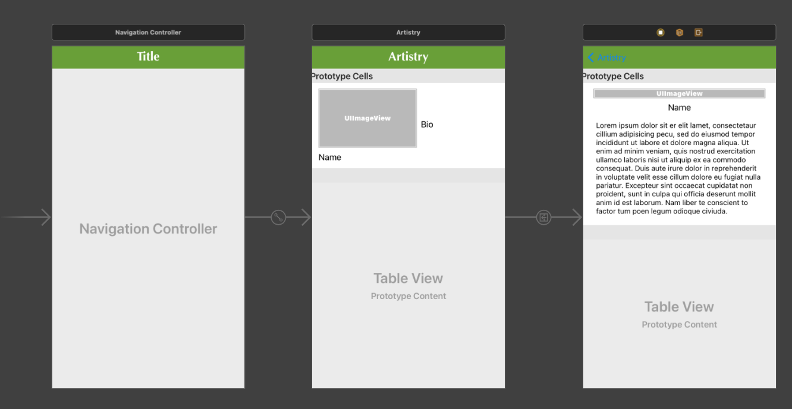

# Swifts-30-Projects - 05

이번에도 MVC 패턴으로 이루어진 프로젝트이다. 

폴더는 Views, Models, ViewControllers, Resources로 이루어져 있다.

# Resources

Resources에 `artists.json` 파일이 있고, 이곳에 사용할 데이터가 저장되어 있다. 

# Views

Views 에는 메인 스토리보드가 존재하고, 두개의 Cell이 존재한다.

메인스토리보드에는 두개의 Scene이 존재한다 (Navigation Controller 제외)



내부에 두개의 셀 파일이 존재하는데, Interface Builder와 연결되어 있고, 그 외의 구현은 없다.

# Models

Artist, Work. 두개의 구조체가 존재한다. Work는 프로퍼티 이외의 구현이 없다.

## Artist

Artist에서 사용하는 프로퍼티는 name, bio, image, works 이다.

내부에는 정적 메서드 `artistsFromBundle()` 가 존재한다.

### artistsFromBundle

`[Artist]` 를 반환하는 메서드이다. 

먼저, 파일을 읽기 위해 `url` 을 생성한다. 이전에 Resources 폴더에 있던 'artists.json' 파일이다. 

다음 `Data` 클래스를 이용해 해당 데이터를 읽는다. 

이때, 해당 'init'은 예외처리를 넘긴다(`throws`)  하여 `do { try } catch { }`

로 묶어 처리한다. 

이후, 직렬화를 수행한다. 요즘 json 파일을 직렬화할때는 `JSONDecoder` 클래스를 사용한다.  여기에서는 `JSONSerialization` 이라는 클래스를 사용하였다.

데이터를 읽고, `[String: Any]` 타입으로 변환한다.  이후 이것을 `for in` 으로 순회하여 name, bio, imageName, works 를 읽어내고, works 내부에 있는 딕셔너리들도 순회해서 꺼낸다. 

이후, Artist 인스턴스를 생성하여 담고, 배열에 추가 하게된다.

마지막에는 이 배열을 반환한다.

: json 파일을 읽어, 구조체 배열로 변환해주는 함수.

# ViewControllers

ViewControllers에 각 Scene별 ViewController를 확인할 수 있다.

## ArtistListViewController

홈화면.

ViewController은 Artist에서 받은 데이터를 기반으로 tableView를 구성한다. 

테이블 뷰의 높이를 automaticDimension으로 설정하고, 예상 높이를 설정하였다.

```swift
NotificationCenter.default.addObserver(forName: UIContentSizeCategory.didChangeNotification, object: .none, queue: OperationQueue.main) { [weak self] _ in
      self?.tableView.reloadData()
    }
```

`UIContentSizeCateogry` 값이 변경되면, Notificaiton이 발생하게 되고, 이것을 옵저버를 사용하여 변화가 있을때마다 tableView를 reload한다. 이후 해당 설정을 삭제해 보았더니, 정상적으로 동작하는 것을 볼 수 있었다.

```swift
override func prepare(for segue: UIStoryboardSegue, sender: Any?) {
    if let destination = segue.destination as? ArtistDetailViewController,
        let indexPath = tableView.indexPathForSelectedRow {
      destination.selectedArtist = artists[indexPath.row]
    }
  }
```

`prepare` 메서드는 storyboard에서 segue를 통해서 사전에 ViewController로 넘어가기 전에 데이터를 설정해준다. 

### extension ArtistListViewController: UITableViewDataSource

tableViewDataSource에서, 셀의 개수와, 각 셀의 데이터를 설정한다. 보통 다른게 없어 생략한다.

사실, `cellForRowAt` 에서 뷰를 설정해준다기보다는 `awakeFromNib`에서 설정해주는 것이 권장된다고 들었다.

## ArtistDetailViewController

마찬가지로, 옵저버를 설정하여 tableView를 reload하고, tableView의 높이를 설정해준다.

### extension ArtistDetailViewController: UITableViewDataSource

셀의 개수, 셀에 들어가는 텍스트, 이미지 등을 설정한다.

### extension ArtistDetailViewController: UITableViewDelegate

`didSelectRowAt` 에서 선택했을때 표시하는 텍스트를 변경하고, 정렬도 변경한다.

`tableView.beginUpdates()` ,`tableView.endUpdates()` 메서드를 통해 새로고침한다. 

해당 메서드를 사용했을 때는 `reloadData`를 수행하지 않아도 된다고 나와있다.

이렇게 높이가 변경될 수 있는 이유는 `viewDidLoad()` 에서 `tableView.rowHeight = UITableView.automaticDimension` 를 설정하여 높이를 자동으로 설정되게 하였기 때문이다.

---

## Ref

- [tableView 변화 처리](https://jcsoohwancho.github.io/2019-10-12-TableView의-변화를-처리하는-방법(1)-Batch-Update/)
- [tableView - Row height 지정](http://blog.naver.com/PostView.nhn?blogId=jdub7138&logNo=220963701224&categoryNo=0&parentCategoryNo=115&viewDate=&currentPage=1&postListTopCurrentPage=1&from=search)