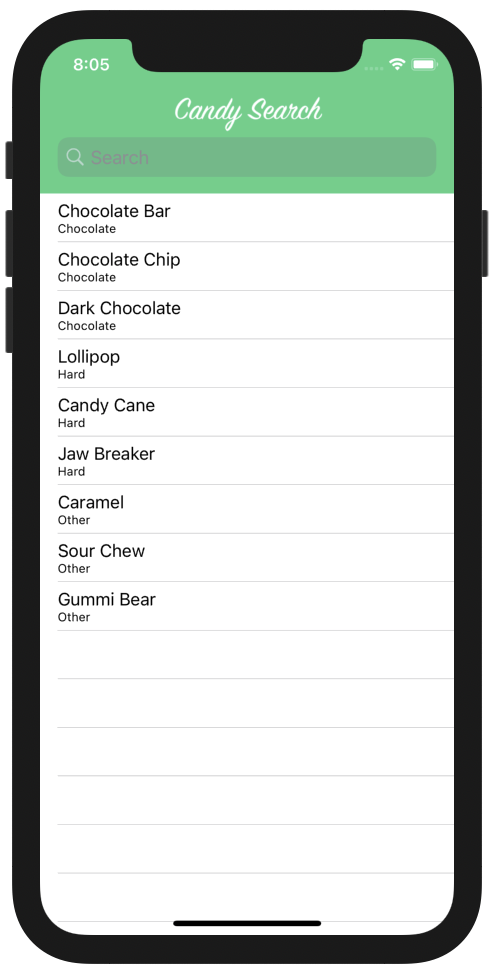
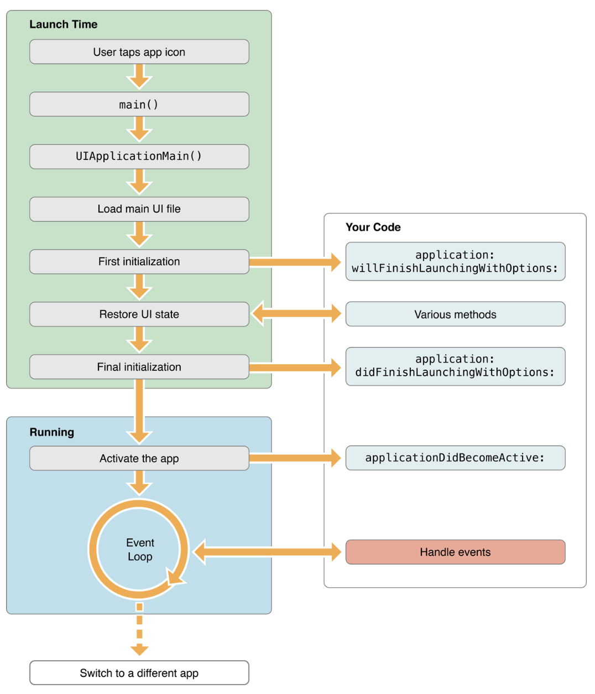

# Swifts-30-Projects - 06

Swift에서는 computed property라는 유용하게 함수의 결과를 property로 나타낼 수 있는 유용한 기능이 있는데, 왜, 굳이, 인자가 없는 함수를 사용하지? 

이번에는 따로 폴더별로 구분지어두지는 않았다. 

ViewController 2개, Model 1개, Main.stroyboard 하나 구성되어 있다. 아, 이번에는 LanchScreen.storyboard도 구현되어 있다.

LaunchScreen은 항상 빈 스토리 보드로 두었던 것 같은데, 이번에는 잠깐 보겠다.

## LaunchScreen.storyboard

해당 스토리 보드는 시작 지점. application이 launch 작업이 진행 중일때, 표시되는 화면이다. 앱의 초기화 작업을 수행하는 시점이고, 이 시간에 사용자에게 화면을 표시하는 것을 H.I.G. 에서도 권장하고 있다. 

해당 설정은 `Info.plist` 에서 'Launch screen interface file base name' 라는 이름으로 스토리보드 파일을 지정할 수 있다.

앱의 Life Cycle을 잠깐 확인해보자. View는 `loadView` 에서부터 `viewDidAppear` 까지의 순서로 뷰가 표시되게 된다. 

그럼 앱은? 아래는 application의 진행 과정이다.

애플리케이션의 생명 주기의 관리는 `AppDelegate`에 의해 수행된다. `AppDelegate`는 애플리케이션(`UIApplication`의 인스턴스)을 위임받아 생명주기에 따라 동작을 처리하는 것이다. `AppDelegate` 클래스가 `UIApplicationDelegate` 를 채택한 것을 보면 알 수 있다.

애플리케이션에 대한 전체적인 설정을 할때에는 `application(_:didFinishLaunchingWithOptions:)` 에서 설정한다. Launch 화면도 이때, 종료된다. 따라서, 해당 메서드에 딜레이를 주면 launch screen이 더 오래 머무르는 것을 볼 수 있다. 

`LaunchScreen.storyboard` 내부는 이미지와 배경 뿐이기에 추가적인 내용은 생략하겠다.

## AppDelegate.swift

### func application(_:,didFinishLaunchingWithOptions:)

`splitViewController`는 이번에 처음봤다. `iPadOS`와 같이 넓은 화면을 염두하여 제작되는 앱에서 column을 분리하기 위해 사용되는 ViewController이다.  ios 에서는 해당 `ViewController`를 사용하여도 차이가 없는 것 같다. splitViewController를 rootViewController로 설정하고, 내부 `navigationViewController`의 `leftBarButtonItem` 을 `splitViewController`의 `displayModeButtonItem`과 연결해준다.

### func splitViewController(_:,collapseSecondary:,onto:)

해당 메서드가 사용되고 나면 secondaViewController의 배열이 쌓이지 않도록 초기화 하고, primary ViewController 하나만 유일하도록 한다.. 라고 하는데..

폰에서 첫 화면에 `DetailViewController`에 표시할 것이 없기 때문에 secondary인 `detailViewController`를 navigationStack에서 제거하도록 설정한 것 같다. 패드에서는 해당 메서드가 실행되지도 않았다.

> `Split View` 로 화면을 분할했을 때! 실행되었다.

split view에서 primary secondary 를 동시에 보여줄 수 없을 때, 합쳐진 화면에서 secondary viewcontroller를 어떻게 처리할지 물어본다는 뜻인 것 같다.

이게 이말이구나 설명을 이제야 이해했다. 

`false` → 합쳐.

`true` → secondary 없애버려. primary 쓴다.

그래서, 한화면에 두개를 split해서 보여줄 수 없는 폰에서는 앱 실행 시에 해당 메서드가 실행 되었고, 처음 실행 했을 때에는 `DetailViewController` 내부 프로퍼티가 `nil`이여서 true가 되었다. 

 

## Main.storyboard

Initial View Controller로 쓰인 가장 왼쪽이 Split View Controller이다.

Split View Controller는 화면을 두개로 나누어 보여주는 Controller이기에 Segue가 기본적으로 두개가 존재한다. master, detail 두개로 사용되고 있다. 두개 모두 `Navigation Controller` 로 감싸져 있다. 두개의 `Navigation Controller` 모두 커스텀 클래스를 사용하지는 않는다.

Master 에는 TableView를 사용하고, Detail에는 StackView로 이루어진 UIView 하나가 존재한다. TableViewCell과 Detail-Navation Controller로  seuge가 설정되어 있다.

아이패드로 디바이스를 변경했을 때 레이아웃이다. 왼쪽에 자동으로 TableView가 설정되어 있다.

## MasterViewController.swift

프로퍼티로 segue를 넘길 `DetailViewControler`, 기본 목록과, 검색된 목록을 나누어 담을 `[Candy]` 배열 두개, `UISearchController` 하나가 있다.

`UISearchController`...도 처음본다.

A view controller that manages the display of search results based on interactions with a search bar.

카톡 검색창, 메시지 검색창. 이런 검색 화면과 결과를 담당하는 친구인 것 같다. 

### override func viewDidLoad()

먼저, Candy목록을 갖고 있는 candies를 초기화 하고, `setUpSearchController` 메서드를 실행한다.

splitViewController를 확인해서, detailViewController를 찾아 연결한다.

### func setupSearchController ()

searchController 설정을 모아둔 메서드이다.

`searchController.searchResultsUpdater = self` ,

`searchController.dimsBackgroundDuringPresentation` 검색 수행 시에 배경 (tableView 어둡게 처리)

`definesPresentationContext` 해당 뷰 컨트롤러의 자식이 화면을 덮을 수 있음.

`searchController.searchBar.scopeButtonTitles = ["All", "Chocolate", "Hard", "Other"]` searchController에서 scope Button 사용 + 배열 지정

`self.navigationItem.searchController?.isActive = true` navigationController에 searchBar 허용.

`self.navigationItem.hidesSearchBarWhenScrolling = false` 스크롤 시에 searchBar를 숨기지 않음.

이후 `tableView`의 `searchBar`를 설정해준다.

### func filterContentForSearchText(_ searchText: String, scope: String = "All")

검색된 배열을 제어하는 메서드

원본 배열에서 filter를 이용하여 candy를 필터링 하고 배열을 reload함.

### override func viewWillAppear(_ animated: Bool)

splitView가 접혀잇을때 selection 상태를 없앤다.

뷰가 표시될때마다 회색으로 select된 것을 없애는 설정. `tableView(_:didSelectRowAt:)` 메서드를 사용하지 않았기 때문에 해당 부분에 설정한 것 같다. 

### override func didReceiveMemoryWarning()

메모리 부족할때 실행되는 메서드이다. 별 다른 구현은 없다.

### override func tableView(_:, cellForRowAt:)

`dequeReusableCell(withIdentifier:for:)` 메서드를 이용해 셀을 불러와 searchController의 상태에 따라 `filteredCandies` 나 `candies` 배열을 이용해 셀을 채운다.

### override func prepare(for:,sender:)

seuge를 통해 화면 전환을 시도하기 직전 수행된다.

해당 Scene에서는 Cell을 선택 할 시에 수행된다. 

Candy 인스턴스를 destination ViewController에 할당하고 해당 ViewController의 navigationItem을 현재 splitViewController의 displayModeButtonItem으로 할당해준다. 왼쪽 navigationItem에 BackButton사용도 true로 바꾸어 준다.

## extension MasterViewController: UISearchResultsUpdating

### func updateSearchResults(for:)

해당 메서드에서는 searchController 인스턴스에서 scope 목록에서 선택된 목록을 가져와 이전에 정의했던, `filterContentForSearchText(_:scope:)` 메서드를 수행한다.

## extension MasterViewController: UISearchBarDelegate

searchBar의 동작을 대신한다.

### func searchBar(_:, selectedScopeButtonIndexDidChange:)

위와 동일하게 검색을 수행함.

이 두개가 뭐가 차이인가 했는데, [해당 링크](https://codershigh.dscloud.biz/techblogs/tb_009_UISearchController/tb009_script.html)에 설명이 있다.

`UISearchBarDelegate` 없어도 검색 결과가 잘 나온다.... 음..

## DetailViewController.swift

`Candy` 타입의 변수 `detailCandy`가 설정되면 뷰를 설정한다.

해당 `ViewController`의 UILabel과 이미지를 업데이트 한다. 

다른 내용이 많이 없으므로 생략.