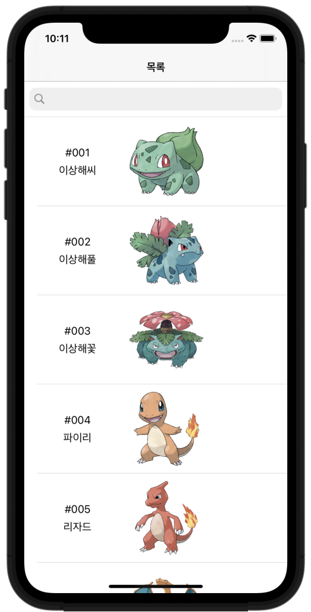
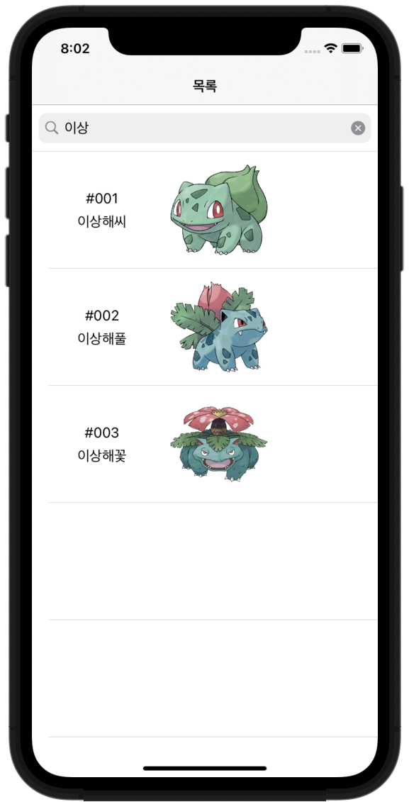

# Swifts-30-Projects - 07

웹에서 이미지를 다운로드 받아 표시되는 포캣몬 도감 앱이다.

## Storyboard

SplitViewController를 이용해 포캣몬에 대한 정보는 `DetailViewController` 에서, 포캣몬을 선택하는 목록은 `MasterViewController` 에서 확인한다.

## AppDelegate

masterViewController, detailViewController 인스턴스를 가져와 최초에 보여질 포캣몬을 `detailViewController.pokemon` 에 할당한다.

`masterViewController.delegate` 와 왼쪽 `navigationItem` 을 설정한다. 

## PersistencyManager

이미지를 저장하고, 사용하기 위한 클래스이다. 

이미지를 저장하는 함수, 이미지를 얻어오는 함수 두가지가 존재한다.

### func saveImage(_ image: UIImage, filename: String)

이미지를 저장하는 함수이다. `NSHomeDirectory()` 함수로 홈 디렉터리의 경로를 얻어와 Documents 디렉터리 내부에 `UIImage` 를 pngData로 저장한다. 

### func getImage(_ filename: String) -> UIImage?

매개변수인 `filename` 을 이용해 저장했던 경로와 동일한 경로에서 데이터를 얻고, 

해당 이미지를 `UIImage` 인스턴스로 반환한다. 

## LibraryAPI

싱글톤 패턴으로 `sharedInstance` 프로퍼티를 사용한다.

### init

Notification 패턴을 이용해 `downloadImageNotification` Notification이 발생했을 때, `downloadImage(_:)` 함수를 호출한다.

### func downloadImg(_ url: String) -> UIImage

파라미터인 문자열을 이용해 `URL` → `Data` → `UIImage` 인스턴스를 생성하여 반환한다.

### @objc func downloadImage(_ notification: Notification)

이미지를 다운로드 받는 함수이다.

notification을 통해 UIImageView 인스턴스(`pokeImageView`)와 주소(`pokeImageUrl`)를 전달받는다. 

`PersistencyManager.getImage` 함수로 이미지를 가져와 해당 `UIImageView`에 할당한다. 

저장된 파일 중 존재하지 않는다면, `downloadImg` 함수를 이용해 이미지를 다운로드 받고, 이것을 UIImageView에 할당하고, `PersistencyManager.saveImage` 함수를 이용해 저장한다.

`DispatchQueue`를 이용한 것은 다운로드는 global 쓰레드에서, 이미지 변경은 main 쓰레드에서 수행되도록 하여 blocking이 일어나지 않도록 하기 위함이다. (UI 작업은 메인 쓰레드에서 이루어짐.)

## Pokemon

### enum PokeType

포캣몬이 가지고 있는 속성에 대한 열거형이다.

### class Pokemon

포캣몬 정보를 담는 클래스이다.

이름, id, 상세 정보, 타입, 약점, 이미지 주소를 포함하고 있다.

## MasterViewController

포캣몬 목록을 선택하는 `TableView`가 포함된 `ViewController`이다.

먼저, 포캣몬 목록을 하드 코딩된 변수에서 가져온다.

검색을 수행할때 검색된 내역들을 담을 프로퍼티도 사용한다.

`delegate`로 `PokemonSelectionDelegate` 프로토콜을 사용한다.

### viewDidLoad

기본 화면 / 설정을 수행하는 `setupUI` 함수를 호출하고, `filteredPokemons` 에 모든 포캣몬들을 할당한다.

### fileprivate func setupUI()

RxSwift를 사용한 부분이다. 

`searchBar`의 `text`를 `Observable`로 바인딩한다.

`throttle`을 주어 방출에 약간의 지연을 둔다.

`subscribe` 에서, searchBar에 입력된 문자가 없을 때에는 전체 포캣몬 목록을, 이외에는 `hasPrefix` 함수를 이용해 포캣몬 목록을 걸러 `filteredPokemons` 배열에 담는다. 

이후, tableView를 다시 로드한다.

### override func tableView(_ tableView: UITableView, didSelectRowAt indexPath: IndexPath)

셀을 선택했을 때에 호출되는 함수이다.

`filteredPokemons` 배열에서 해당 포캣몬 클래스를 가져오고, delegate를 이용해 해당 포캣몬이 선택됨을 전달한다.

`splitViewController.showDetailViewController` 함수를 이용해 `detailViewController.navigationController` 로 전환한다.

### override func tableView(_ tableView: UITableView, cellForRowAt indexPath: IndexPath) -> UITableViewCell

셀을 화면에 표시할 때에 호출되는 함수이다.

`dequeueReusableCell` 을 이용해 셀을 재사용하고, 해당하는 포캣몬 클래스를 가져온다. 

`cell.awakeFromNib` 을 직접 호출하여 정보를 전달하고, 화면을 내부 데이터를 할당하여 셀을 반환한다.

## MasterTableViewCell

포캣몬 선택 화면인 `MasterViewController`의 `TableView`에서 사용되는 셀이다.

### func awakeFromNib(_ id: Int, name: String, pokeImageUrl: String)

화면을 표시할 때에 호출되는 함수이다. `setupUI(id, name: name)` , `setupNotification(pokeImageUrl)` 두개의 함수를 호출한다.

### fileprivate func setupUI(_ id: Int, name: String)

기본 이미지와 `UIActivityIndicator` 를 이용해 다운로드 전 빈 화면을 채운다.

KVO 패턴을 이용해 `pokeImageView` 옵저버를 추가한다.

### fileprivate func setupNotification(_ pokeImageUrl: String)

`Notification`을 전송한다. `UIImageView`와 이미지의 주소 문자열을 `userInfo` 에 담아 post한다.

### override func observeValue(forKeyPath keyPath: String?, of object: Any?, change: [NSKeyValueChangeKey : Any]?, context: UnsafeMutableRawPointer?)

KVO 패턴에서 사용된다. 

위 `pokeImageView` 로 이미지가 할당 되었을 때에 `indicator`를 멈춘다. 

## DetailViewController

포캣몬 하나에 대한 이미지와 설명을 볼수 있는 ViewController이다.

클래스 내부 pokemon 프로퍼티가 대입되었을 때에 `refreshUI()` 함수를 호출해 화면을 갱신한다.

### func refreshUI()

포캣몬의 이름 / 번호 / 이미지 / 세부 설명을 각 `UIView` 들에 할당한다.

### func pokemonSelected(_ newPokemon: Pokemon)

`PokemonSelectionDelegate` 프로토콜에서 채택해 정의한 함수이다. 

파라미터로 받은 포캣몬 인스턴스를 클래스 내부에 할당한다.