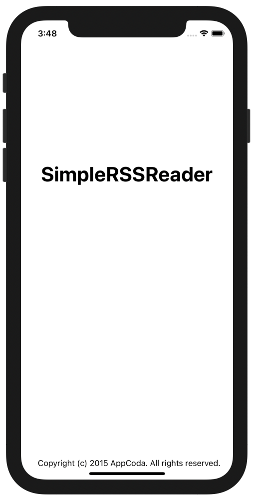

# Swifts-30-Projects - 08

**Preview**




씬은 `LaunchScreen`과 `TableViewController` 를 구현한 `NewsTableViewController` 두개만 존재한다. 

파일은 `Main.storyboard` , `NewsTableViewCell.swift` , `NewsTableViewController.swift` , `FeedParser.swift` 가 존재한다.

## Main.storyboard


`TableViewController` 하나만 존재하나, `NavigationController`로 감싸져 있다.

## FeedParser

모델의 역할을 수행하는 FeedParser 클래스이다. `XMLParserDelegate` 를 이용하여 웹에서 받아온 XML 파일을 파싱한다.

`XMLParser` 인스턴스가 파싱을 수행하고, 세부 구현은 `XMLParserDelegate` 프로토콜을 채택하여 구현하였다.

파싱된 목록들은  `rssItems` 에 저장한다.

`currentElement`, `currentTitle`, `currentDescription`, `currentPubDate` 는 파싱 과정에서 사용되는 변수이다. `didSet` 에서, `trimmingCharacters` 메서드를 이용해 문자열의 양 끝 공백을 다듬는다.

`parserCompletionHandler` 는 클로저이다. 해당 코드는 파싱이 완료된 이후, 화면 처리를 위해 사용된다.

`parseFeed(feedURL:completionHandler:)` 는 `URLSession` 을 생성하여 rss feed를 가져오고, 인자로 받은 `completionHandler`를 클래스 내부 클로저 변수 `parserCompletionHandler` 에 할당한다.

아래 코드를 보자.

```swift
func parseFeed(feedURL: String, completionHandler: (([(title: String, description: String, pubDate: String)]) -> Void)?) -> Void {
    
    parserCompletionHandler = completionHandler
    
    guard let feedURL = URL(string:feedURL) else {
      print("feed URL is invalid")
      return
    }
    
    URLSession.shared.dataTask(with: feedURL, completionHandler: { data, response, error in
      if let error = error {
        print(error)
        return
      }
      
      guard let data = data else {
        print("No data fetched")
        return
      }
      
      let parser = XMLParser(data: data)
      parser.delegate = self
      parser.parse()
    }).resume()
  }
```

첫번째, `parserCompletionHandler = completionHandler` 에서, 함수의 인자로 받은 클로저를 클래스 내부 변수에 담는다.

두번째, `URL` 구조체를 생성한다. 

세번째, `URLSession` 을 수행한다. 해당 부분에서도 `completionHandler`가 콜백으로 사용된다. 

에러와 유효성을 확인하고, 받아온 데이터를 이용해 파싱을 수행한다.. 파싱은 `XMLParser` 클래스를 사용하고, 세부 구현은 delegate를 이용하였다. `parse()` 메서드를 호출함으로써 수집한 데이터를 파싱한다.

### XMLParser 세부 구현

`func parserDidStartDocument(_:)` 

파싱이 시작될때 수행된다. 파싱된 목록을 담을 `rssItems` 배열을 비운다.

`func parser(_:,didStartElement:,namespaceURI:,qualifiedName:,attributes:)`

parser가 시작 태그를 만나면 호출된다. 이때 `currentElement`에 태그의 이름을 담는다.

`<item>` 을 만났을 때, 변수에 있던 문자열을 비운다. 

이후 `parser(_:,foundCharacters:)` 메서드가 수행된다.

`func parser(_:,foundCharacters:)`

`foundCharacters`에 태그 내부의 String이 담긴다. 위 메서드에서 담긴 `currentElement` 를 기준으로 `foundCharacters` 내부의 문자열을 담는다.

해당 메서드 내부는 아래와 같이 구현되어있다. 


왜 += 을 이용해서 문자열을 저장했을까했는데, 디버깅 해본 결과, 수집된 문자열이 한번에 꺼내지지 않는다.

태그가 시작될 때 `parser(_:,didStartElement:,namespaceURI:,qualifiedName:,attributes:)` 가 수행되고
태그 내부는 `parser(_:,foundCharacters:)` 메서드가 수행된다. 

그리고 태그가 닫힐때 `parser(_:,didEndElement:,namespaceURI:,qualifiedName:)` 가 수행된다.

`parser(_:,didEndElement:,namespaceURI:,qualifiedName:)`

닫힌 태그이름이 item일때, 수집된 데이터(`currentTitle`, `currentDescription`, `currentPubDate`) 를 배열 `rssItems` 에 담는다.

`func parserDidEndDocument(_:)`

파싱이 종료되었을 때 호출된다. `parseFeed(feedURL:completionHandler:)` 메서드에서 인자로 받은 `completionHandler` 파라미터를 수행한다.

`func parser(_:,parseErrorOccurred:)`

에러처리 함수이다. 에러를 출력한다.

## NewsTableViewCell

`UITableViewCell` 을 상속받아 `NewsTableViewController`에서 셀을 담당한다.

`UILabel`이 설정될때, `numberOfLines`를 설정한다. 초기 화면은 `description`을 4줄만 표시한다. 

## NewsTableViewController

`UITableViewController` 를 상속받아 구현했습니다.

`FeedParser` 클래스에서 파싱을 수행한다. `rssItems`  변수에서는 파싱된 데이터를 담는다.

`cellStates` 는 `CellState` 타입의 배열이고, 셀이 접힌 상태를 저장한다.

`CellState` 은 열거형으로 `.exanped`, `.collapsed` 두가지이다.

### viewDidLoad

변수의 높이를 지정, tableView의 SeperatorStyle을 지정한다.

`parseFeed(feedURL:,completionHandler:)` 를 수행.

`feedURL`은 수집하는 주소. `completionHandler` 클로저이다. 셀의 값을 설정하고, tableView의 리로드한다.

### func tableView(_:,cellForRowAt:) -> UITableViewCell

각 row의 `UITableViewCell`을 설정하는 메서드이다. 셀 내부에 들어가는 값을 설정하고, cellStates 배열을 이용해 이 접힌 상태인지를 확인 후 라인 길이를 결정한다.

### func tableView(_:,didSelectRowAt:)

셀이 `.collapsed` 인지, `.expanded` 인지 확인하여 토글을 수행한다.

`tableView.beginUpdates()` `tableView.endUpdates()`  메서드를 이용해 변경된 레이아웃을 적용하고 애니메이션 효과를 주었다.


------

## Refactor

```
typealias RssItem = (title: String, description: String, pubDate: String)
```

기존에 `(title: String, description: String, pubDate: String)` 그대로 인자로 넘겼기 때문에 `RssItem` 으로 축약하였다.

```
protocol FeedParserDelegate
```

스위프트에서 사용되는 콜백 패턴은 두가지가 있다.

1. Closure를 파라미터로 전달 받음.
2. 프로토콜을 이용한 콜백

기존 코드는 전자였고, 공부 삼아 이것을 후자로 변경해 보았다.

```swift
// NewsTableViewController.swift
feedParser.delegate = self
extension NewsTableViewController: FeedParserDelegate {
  func updateItems(with rssItems: [RssItem]) {
    self.rssItems = rssItems
    self.cellStates = Array(repeating: .collapsed, count: rssItems.count)
    
    DispatchQueue.main.async {
      self.tableView.reloadSections(IndexSet(integer: 0), with: .none)
    }
  }
}

// FeedParser.swift
protocol FeedParserDelegate {
  func updateItems(with rssItems: [RssItem])
}

var delegate: FeedParserDelegate?
func parserDidEndDocument(_ parser: XMLParser) {
    delegate?.updateItems(with: rssItems)
}
```

