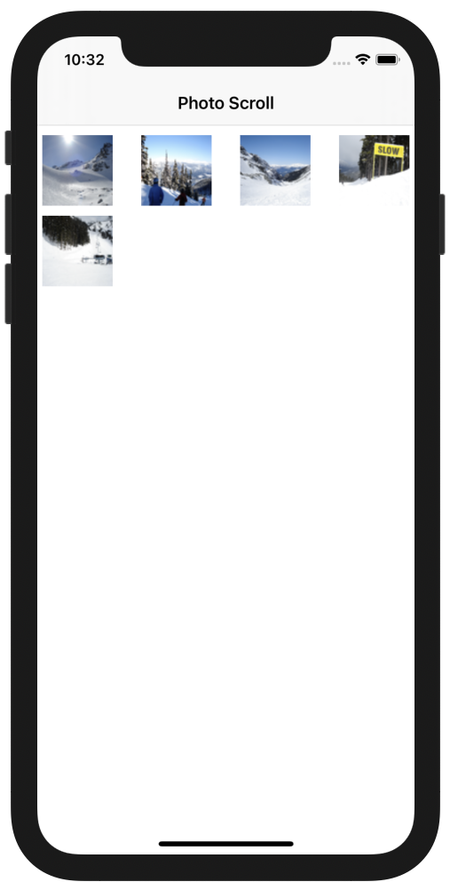

# Project 09 - PhotoScroll


   


## Main.storyboard


이번에는 ViewController가 `NavigationViewController`를 제외해도 4개이다. 앱 내에서 화면 전환은 3개의 ViewController가 확인되는데, 하나는 `UIPageViewController` 를 상속받아 구현한 `ManagePageViewController` 이다. 그리곡 각 ViewController 별로 그룹이 형성되어 있다.

그런데.. `UIPageViewController` 가....뭐지?

## extension UIImage

`UIImage` 클래스에 extension을 이용해 메서드를 추가하였다.

```swift
  func thumbnailOfSize(_ size: CGFloat) -> UIImage {
    UIGraphicsBeginImageContext(CGSize(width: size, height: size))
    let rect = CGRect(x: 0.0, y: 0.0, width: size, height: size)
    UIGraphicsBeginImageContext(rect.size)
    draw(in: rect)
    let thumbnail = UIGraphicsGetImageFromCurrentImageContext();
    UIGraphicsEndImageContext()
    return thumbnail!
  }
```

`UIGraphicsBeginImageContext` 메서드를 이용해서 image context를 생성하고 

`draw` 메서드로 context에 그린다.

`UIGraphicsGetImageFromCurrentImageContext` 메서드에서 draw로 그린 image context를 가져온다.

`UIGraphicsEndImageContext` 에서 생성한 context 를 제거한다. 

## CollectionViewController

### func prepare(for:,sender:)

segue를 통해 다른 씬으로 넘어가기 이전에 수행되는 `prepare` 메서드이다. 

UICollectionViewCell을 선택한 것인지 확인하고, `segue.destination` 을 확인해 사용할 photo와, index를 ViewController에 값을 대입한다. 

### DataSource

`func collectionView(_:, cellForItemAt:) -> UICollectionViewCell`

collectionView의 각 row의 cell을 설정하는 함수이다. `collectionView.dequeueReusableCell` 메서드를 이용해 셀을 받아오고, 셀의 이미지를 `UIImage.thumbnailOfSize` 메서드를 이용해 축소하여 설정하였다.:

### UICollectionViewDelegateFlowLayout

해당 프로토콜을 채택하여 CollectionView의 레이아웃을 결정하였다.

`func collectionView(_:,layout:,sizeForItemAt:) -> CGSize` 

`CGSize` 타입으로 각 셀의 사이즈를 반환한다. 사전에 정해둔 상수로 셀의 크기를 결정.

`func collectionView(_:,layout:,insetForSectionAt:) -> UIEdgeInsets`

레이아웃 내부에 padding을 주는 `UIEdgeInsets` 클래스를 반환한다.

## ManagerPageViewController

`UIPageViewController` 를 상속받아 구현하였다. 해당 ViewController는 여러 개의 뷰를 페이징 처럼 넘기면서 볼 수 있도록 한다.

홈 화면인 `CollectionViewController` 에서 segue를 통해 해당 ViewController로 전환된다. 

두번째 화면과 동일한 화면인데, `UINavigationController` - `ManagerPageViewController` - `PhotoCommentViewController` 순서로 ViewController가 쌓여있는 것이 확인 가능하다.


`ManagerPageViewController` 의 view 내부에는 `UIPageControl` 하나와 `UIQueueingScrollView` 가 존재한다. `UIQueueingScrollView` 에는 세개의 `UIView` 가 존재했는데, 현재 보여지는 ViewController 하나, Page 내부 Queue로 가지고 있는 두개인 것 같다.

### viewDidLoad

dataSource 를 지정하고, `setViewControllers` 메서드를 수행하여 가장 먼저 사용할 ViewController를 지정한다.

구현된 `viewPhotoCommentController(index:) -> PhotoCommentViewController?` 메서드를 이용해 ViewController를 받아, 이것을 초기 화면에 적용한다. 

`currentIndex`와 photo 정보는 이전 화면에서 segue로 넘어올 때, 전달 받은 값을 사용한다.

### func viewPhotoCommentController(index:) -> PhotoCommentViewController?

인덱스에 해당하는 `PhotoCommentViewController` 를 생성해 반환하는 함수이다.

storyboard에서  viewController를 받아와 photo와 index 정보를 담고 반환한다.

## extension ManagePageViewController: UIPageViewControllerDataSource

### func pageViewController(**_**:,viewControllerBefore:) -> UIViewController?

`UIPageViewController`에서 이전 page에 대한 화면 정보가 없을 때 호출된다. 

위에서 정의한 `viewPhotoCommentController(index:)` 를 사용해 이전 인덱스에 해당하는 `UIViewController`를 반환한다.

### func pageViewController(**_**:,viewControllerAfter:) -> UIViewController?

위 함수와 기능은 동일하며, 이전이 아닌 이후 page에 대한 `UIViewController` 를 반환한다.

### func presentationCount(for:) -> Int

`UIPageControl` 에서, 총 개수를 반환

### func presentationIndex(for:) -> Int

현재 인덱스 번호를 출력

## PhotoCommentViewController

사진과 commnet 를 작성할 수 있는 ViewController이다.

### viewDidLoad

photoName 을 기반으로 imageView의 이미지를 설정한다.

`UITapGestureRecognizer` 인스턴스를 생성하고, `addGestureRecogniazer` 메서드를 이용해 view와 imageView에 추가한다.

Notificiation 패턴을 이용해, 키보드가 표시될 때, 키보드가 사라질 때 동작을 설정한다.

### deinit

viewDidLoad에서 설정했던 Notification을 해제한다.

### func adjustInsetForKeyboard(isShow:, notification:)

키보드에 의해서 가려지는 scrollView 화면을 위로 올릴 목적으로 사용한다.

키보드가 표시될때, 사라질 때 해당 메서드가 다른 메서드 들에 의해 호출된다. 

```swift
fileprivate func adjustInsetForKeyboard(isShow: Bool, notification: Notification) {
    guard let value = notification.userInfo?[UIResponder.keyboardFrameBeginUserInfoKey] as? NSValue else {
      return
    }
    let keyboardFrame = value.cgRectValue
    let adjustmentHeight = (keyboardFrame.height + 20) * (isShow ? 1 : -1)
    scrollView.contentInset.bottom += adjustmentHeight
    scrollView.scrollIndicatorInsets.bottom += adjustmentHeight
  }
```

### @objc func dismissKeyboard()

editing 상태를 종료로 바꾼다. (키보드가 내려감)

### @objc func keyboardWillShow(notification:)

Oberserver를 통해서 `UIResponder.keyboardWillShowNotification` 일때 호출된다. 

`adjustInsetForKeyboard(isShow:,notification:)` 메서드를 호출한다.

### @objc func keyboardWillHide(notification:)

Oberserver를 통해서 `UIResponder.`keyboardWillHideNotification 일때 호출된다. 

`adjustInsetForKeyboard(isShow:,notification:)` 메서드를 호출한다.

### @objc func openZoomingController(sender:)

`imageView`에 추가된 `UITapGestureRecognizer`에 의해 호출된다. 

`performSegue` 메서드가 호출되어 `ZoomedPhotoViewController` 화면으로 전환한다.

`seuge`를 통해 `prepare` 메서드가 호출된다. 

### override func prepare(for:,sender:)

performSegue가 호출될 때, 해당 메서드가 호출된다. 

`segue.identifier`를 확인해 `segue.destination` 인 `ZoomedPhotoViewController` 의 photo 정보를 설정한다. 

## ZoomedPhotoViewController

이미지의 Zoom In/Out 이 가능한 `UIViewController`이다. `UIImageView`가 존재하며 이것을 `UIScrollView` 가 감싸고 있다. 

### viewDidLoad

이전 `UIViewController`의  segue에서 전달받은 photo 정보를 이용해 imgageView의 이미지를 설정한다.

### viewDidLayoutSubviews

레이아웃 결정 후 마무리 작업 시에 해당 메서드가 호출된다. 이때 zoom scale 을 설정하는 `minimumZoomScale` 메서드를 호출한다. 

### func updateConstraints(forSize:)

imageView의 constraints 를 결정하는 메서드이다. 

핀치 줌 / 아웃 후에 변경되는 imageView의 constraint를 적절하게 수정한다.

```swift
fileprivate func updateConstraints(forSize size: CGSize) {
    let yOffset = max(0, (size.height - imageView.frame.height) / 2)
    imageViewTopConstraint.constant = yOffset
    imageViewBottomConstraint.constant = yOffset
    
    let xOffset = max(0, (size.width - imageView.frame.width) / 2)
    imageViewLeadingConstraint.constant = xOffset
    imageViewTrailingConstraint.constant = xOffset
    view.layoutIfNeeded()
  }
```

constraint를 0과 (view.bounds.size - imageView.frame) / 2 중 큰 수로 제약을 다시 설정하는데, max를 이용해서 항상 0 이상으로 나오도록 구현한 것이 매우 적절하다고 생각했다. 

마지막에는 `view.layoutIfNeeded()` 메서드를 호출해 빠르게 화면이 수정되도록 한다. 


top / bottom 의 contraint 의 경우 붉은 선 각각이 계산된 `(size.height - imageView.frame.height) / 2` 일 것이다.


scrollView - imageView 의 bottom 은 게산된 대로인 것 같은데, top은 무언가 조금 적절하지 못하게 나온 듯 하다. 

### func updateMinZoomScale(forSize:)

최소 zoom scale 을 결정하는 메서드이다. 

화면 크기 비례로 최소 비율을 찾아. scrollView의 zoomScale로 적용한다. 

## extension ZoomedPhotoViewController: UIScrollViewDelegate

### func viewForZooming(in:) -> UIView?

함수 이름 그대로 zoom할때 어떤 UIView를 확대할지를 지정한다. 

여기에서는 imageView 반환

### func scrollViewDidZoom(_:)

zoom 동작이 완료 되었을때 호출. `updateContraints` 함수를 호출함.