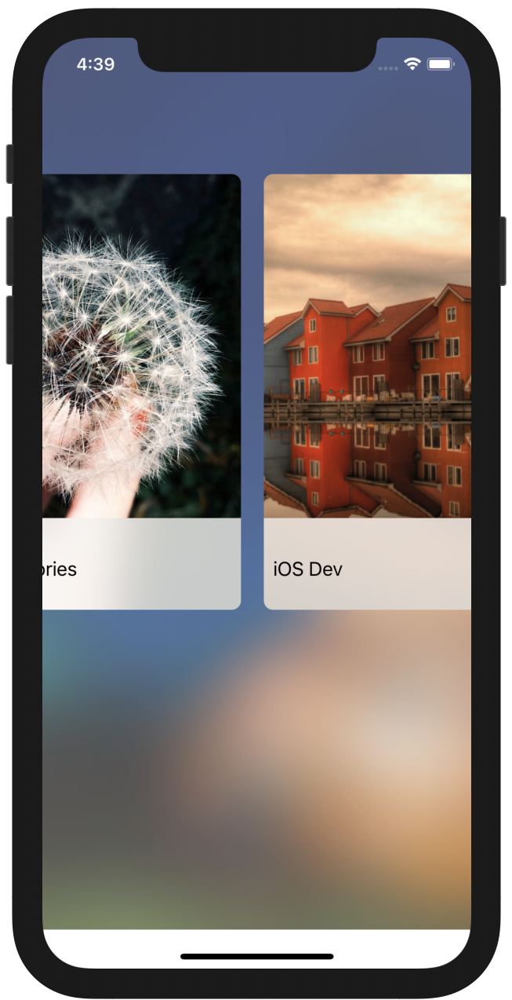

# Swifts-30-Projects - 10




가로로 스크롤 하는 카드를 가지고 있는 앱이다. ViewController 하나로 이루어져 있다.

## Main.storyboard


ViewController 내부 최상단 View에는 백그라운드 이미지와, `Visual Effect View` 가 존재한다.

정확하게는 `Visual Effect View with blur` 이다. 배경의 Blur 역할을 한것이 해당 View이다.

내부에는 `CollectionView`가 존재하고, `CollectionViewCell` 내부에도 Visual Effect View가 존재한다.

## Interest

Model로 사용되는 클래스이다. 해당 뷰를 표시하기 위해 필요한 정보들을 구조화 하여 담기 위해 사용한다. static 함수로 배열을 반환한다.

## InterestCollectionViewCell

CollectionView에서 사용되는 Cell이다. `UIImageView` 하나와 `UILabel` 하나로 이루어져 있으며, didSet을 이용해 `Interest` 인스턴스가 할당 되었을 때, UI를 업데이트한다. 

`layoutSubviews` 메서드에서 cornerRadius 를 적용한다.

## HomeViewController

메인 홈에서 사용되는 ViewController이다. `@IBAction` 으로 배경 이미지와 컬렉션 뷰를 연결하였다. `interests` 변수에 필요한 데이터를 배열로 저장하였다.

UICollectionViewDataSource, UIScrollViewDelegate 프로토콜을 채택해, CollectionView에서 필요한 데이터와 스크롤에 대한 이벤트를 처리하였다.

`preferredStatusBarStyle` 변수를 오버라이딩 하여 선호되는 StatusBar Style을 지정하였다.

### func collectionView(_:,numberOfItemsInSection:) -> Int

`UICollectionViewDataSource` 프로토콜을 채택하여 선언한 함수이다. collectionview 에서 섹션별 Item의 개수를 반환한다. 

### func collectionView(_:,cellForItemAt:) -> UICollectionViewCell

tableView의 `cellForRowAt` 함수와 동일한 역할이다. `interests` 에서 값을 꺼내어 셀에 할당 하고, 할당된 셀을 반환하였다.

### func scrollViewWillEndDragging(_:,withVelocity:,targetContentOffset:)

`UIScrollViewDelegate`를 채택하여 선언한 함수이다. 사용자가 드래그 동작을 마친 이후(손락을 뗏을 때) 수행된다.

- `withVelocity` : 터치 해제 시 속도
- `targetContentOffset` : 스크롤 속도가 줄어 덩지될 때 예상되는 위치

```swift
func scrollViewWillEndDragging(_ scrollView: UIScrollView, withVelocity velocity: CGPoint, targetContentOffset: UnsafeMutablePointer<CGPoint>) {
    let layout = self.collectionView.collectionViewLayout as! UICollectionViewFlowLayout
    let cellWidthWithSpace = layout.itemSize.width + layout.minimumLineSpacing
    
    var offset = targetContentOffset.pointee
    
    let index = (offset.x + scrollView.contentInset.left) / cellWidthWithSpace
    let roundedIndex = round(index)
    
    offset = CGPoint(x: roundedIndex * cellWidthWithSpace - scrollView.contentInset.left, y: -scrollView.contentInset.top)
    targetContentOffset.pointee = offset
  }
```

item 하나의 사이즈와 item 간의 간격을 구해서 하나의 item 크기로 설정함.

예상되는 위치를 `offset` 변수에 담은 뒤 현재 보고있는 collectionViewCell의  index를 계산한다.

offset을 재계산하여 `targetContentOffset.pointee` 변수에 해당 컨텐츠의 offset을 다시 설정한다.