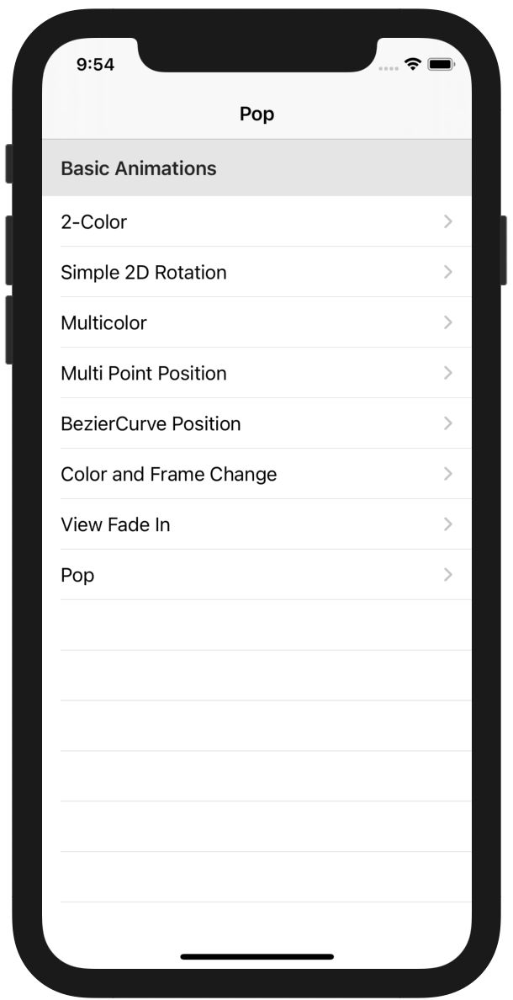

# Swifts-30-Projects - 11




`UIViewController`가 두개 존재하며, 첫번째 `ViewController` `tableView`의 셀을 선택하면 새로운 `UIViewController`가 표시된다. 

각각의 `ViewController` 별로 사격형이나 원이 존재하고, 버튼 클릭 시 애니메이션을 표시한다.

## Main.storyboard


홈 화면으로 talbeView를 가진 `ViewController`가 존재한다. segue를 통해서 다음 `ViewController`가 표시된다.

## Common.swift

다른 ViewController에서 사용할 상수 및 함수를 선언하였다.

### func drawRectView(_ color:, frame: CGRect, center: CGPoint) -> UIView

매개 변수를 받은대로 화면의 크기, 색, center에 맞게 사각형의 `UIView`를 생성한다.

### func drawCircleView() → UIView

원형의 UIView를 생성한다. `UIBezierPath`, `CAShapeLayer`를 처음 보기 때문에 코드를 확인해 보겠다.

```swift
func drawCircleView() -> UIView {
  let circlePath = UIBezierPath(arcCenter: CGPoint(x: 100,y: screenRect.midY - 50), radius: CGFloat(20), startAngle: CGFloat(0), endAngle:CGFloat(Double.pi * 2), clockwise: true)
  
  let shapeLayer = CAShapeLayer()
  shapeLayer.path = circlePath.cgPath
  
  shapeLayer.fillColor = UIColor.red.cgColor
  shapeLayer.strokeColor = UIColor.red.cgColor
  shapeLayer.lineWidth = 3.0
  
  let view = UIView()
  view.layer.addSublayer(shapeLayer)
  
  return view
}
```

`UIBezierPath` 클래스는 커스텀 뷰에서 직선이나 곡선을 긋는 역할을 한다. 베지어 곡선을 그릴 수 있다. 베지에 곡선을 이용해서 원을 그린다. 

`CAShapeLayer` 클래스를 이용해서 UIBezierPath 인스턴스에서 생성한 원을 그리고, fill/stroke color를 설정한다.

그냥 그림만을 그려서 표시할 때에는 `UIBezierPath` 클래스만 사용해도 되고, 애니메이션으로도 표한하기 위해서는 `CAShapeLayer` 를 사용할 수 있다. 

### func makeAlert(_ title: String, message: String, actionTitle: String) -> UIAlertController

`UIAlertController` 에서 사용되는 메시지들을 설정해 `UIAlertController` 인스턴스 생성.

## ViewController

### func animateTable()

`viewWillAppear` 에서 호출되는 함수. tableView에서 애니메이션을 생성함.

각 셀의 위치를 테이블 뷰의 가장 아래로 위치.

현재 등록된 모든 셀들의 위치를 아래로 내렸다가.

`UIView.animate` 메서드에 `animations` 파라미터에 클로저로 cell의 위치를 변경하는 부분이 작성된다.

tableview 내부에 있는 cells들을 모두 `CGAffineTransform` 을 이용해 각 cell의 원래 위치에 위치하도록 transform 효과 적용.

### func prepare(for:,sender:)

화면 전환이 이루어질때 호출되는 함수. `segueDetailIdentifier`를 이용해 전달하려는 segue인지 확인하고 `segue.destination` 인 `DetailViewController` 에 값을 할당한다. (navigation title 변경)

### func tableView(_:, heightForHeaderInSection:) -> CGFloat

각 섹션별 헤더의 높이를 반환함. 

### func tableView(_:,titleForHeaderInSection:) -> String?

해당 섹션의 헤더를 반환한다. 

## DetailViewController

### func setupRect()

가운데에 필요한 UIView를 그린다. 이전 화면인 테이블 뷰에서 각각의 셀별로 그림이 다르기 때문에 각각 다른 함수를 사용해서 그림을 그린다. 그림에 대한 자세한 부분은 해당 함수가 정의된 부분에서 설명할 것이다.

### @IBAction func didTapAnimate(_ sender: AnyObject)

Animate 버튼을 클릭했을 때 호출되는 함수이다.

barTitle에 따라 (이전 화면에서 선택했던 각각의 셀마다 다른 동작을 수행한다.

각 barTitle 마다 존재하는 case 별로 확인해보겠다.

```swift
case "2-Color":
      changeColor(UIColor.green)

/* ------------------------------------- */

fileprivate func changeColor(_ color: UIColor) {
    UIView.animate(withDuration: self.duration, animations: {
      self.animateView.backgroundColor = color
      }, completion: nil)
  }
```

`UIView.animate` 메서드를 이용해 화면의 전환을 표시한다. 

```swift
case "Simple 2D Rotation":
      rotateView(Double.pi)

/* ------------------------------------- */

fileprivate func rotateView(_ angel: Double) {
    UIView.animate(withDuration: duration, delay: delay, options: [.repeat], animations: {
      self.animateView.transform = CGAffineTransform(rotationAngle: CGFloat(angel))
      }, completion: nil)
  }
```

이번에도 `UIView.animate` 함수를 이용해 애니메이션을 표시한다. `CGAffineTransform` 인스턴스를 생성해서 해당 `UIView.transform` 에 할당하여 애니메이션을 표현하도록 한다. options 파라미터에서, `UIView.AnimationOptions.repeat` 옵션을 준다.

```swift
case "Multicolor":
      multiColor(UIColor.green, UIColor.blue)

/* ------------------------------------- */

fileprivate func multiColor(_ firstColor: UIColor, _ secondColor: UIColor) {
    UIView.animate(withDuration: duration, animations: {
      self.animateView.backgroundColor = firstColor
      }, completion: { finished in
        self.changeColor(secondColor)
    })
  }

```

 `firstColor` → `secondColor` 로 화면 전환을 수행한다. animations 클로저가 호출된 이후, completion 클로저가 수행된다.

`animate` 함수를 통해 점진적으로 `firstColor`로 변경되고, 이후에 `completion`을 통해 점진적으로 `secondColor`로 변경한다.

```swift
case "Multi Point Position":
      multiPosition(CGPoint(x: animateView.frame.origin.x, y: 100), CGPoint(x: animateView.frame.origin.x, y: 350))

/* ------------------------------------- */

fileprivate func multiPosition(_ firstPos: CGPoint, _ secondPos: CGPoint) {
  func simplePosition(_ pos: CGPoint) {
    UIView.animate(withDuration: self.duration, animations: {
      self.animateView.frame.origin = pos
    }, completion: nil)
  }
  
  UIView.animate(withDuration: self.duration, animations: {
    self.animateView.frame.origin = firstPos
    }, completion: { finished in
      simplePosition(secondPos)
  })
}
```

barTitle이 "Multi Point Position" 일때 수행되는 `multiPosition` 함수에는 내부에 `simplePosition` 함수가 존재한다.  

하여 내부 구조가 `UIView.animate` 가 종료되면,  `UIView.animate` 가 수행된다. 하여 흐름은 이런 느낌.

```swift
UIView.animate(withDuration: self.duration, animations: {
      self.animateView.frame.origin = firstPos
      }, completion: { _ in
        UIView.animate(withDuration: self.duration) {
          self.animateView.frame.origin = secondPos
        }
    })
  }
```

해당 `UIView` 가 `firstPos` 위치로 이동 → `secondPos` 로 이동 하게된다.

```swift
case "BezierCurve Position":
      var controlPoint1 = self.animateView.center
      controlPoint1.y -= 125.0
      var controlPoint2 = controlPoint1
      controlPoint2.x += 40.0
      controlPoint2.y -= 125.0;
      var endPoint = self.animateView.center;
      endPoint.x += 75.0
      curvePath(endPoint, controlPoint1: controlPoint1, controlPoint2: controlPoint2)

/* ------------------------------------- */

fileprivate func curvePath(_ endPoint: CGPoint, controlPoint1: CGPoint, controlPoint2: CGPoint) {
    let path = UIBezierPath()
    path.move(to: self.animateView.center)
    
    path.addCurve(to: endPoint, controlPoint1: controlPoint1, controlPoint2: controlPoint2)

    // create a new CAKeyframeAnimation that animates the objects position
    let anim = CAKeyframeAnimation(keyPath: "position")
    
    // set the animations path to our bezier curve
    anim.path = path.cgPath
    
    // set some more parameters for the animation
    anim.duration = self.duration
    
    // add the animation to the squares 'layer' property
    self.animateView.layer.add(anim, forKey: "animate position along path")
    self.animateView.center = endPoint
  }
```

`controlPoint1`, `controlPoint2`, `endPoint` 세개의 변수를 선언하여 위치를 설정한 뒤, `curvePath`에게 인자로 넘긴다. 

호출되는 `curvePath` 메서드는 `UIBezierPath` 를 이용해 경로를 그려 애니메이션을 생성한다. 

`path.move` 로 최초 경로를 그릴 위치로 이동한다.

`path.addCurve` 메서드를 이용해 이동할 곡선을 표현한다.  addCurve 메서드를 사용하기 위해서는 베지에 곡선에 대한 선행이 필요하다. controlPoint2가 2개이므로 3차 베지어 곡선으로 선을 그린 것이다.

layer 객체에 적용할 수 있는 `CAKeyframeAnimation` 타입 인스턴스를 생성한다. 인스턴스의 `path`, `duratoin`을 설정한 뒤, `UIView`의 `layer`에 추가한다.

```swift
case "Color and Frame Change":
  let currentFrame = self.animateView.frame
  let firstFrame = currentFrame.insetBy(dx: -30, dy: -50)
  let secondFrame = firstFrame.insetBy(dx: 10, dy: 15)
  let thirdFrame = secondFrame.insetBy(dx: -15, dy: -20)
  colorFrameChange(firstFrame, secondFrame, thirdFrame, UIColor.orange, UIColor.yellow, UIColor.green)

/* ------------------------------------- */

fileprivate func colorFrameChange(_ firstFrame: CGRect, _ secondFrame: CGRect, _ thirdFrame: CGRect, _ firstColor: UIColor, _ secondColor: UIColor, _ thirdColor: UIColor) {
    UIView.animate(withDuration: self.duration, animations: {
      self.animateView.backgroundColor = firstColor
      self.animateView.frame = firstFrame
      }, completion: { finished in
        UIView.animate(withDuration: self.duration, animations: {
          self.animateView.backgroundColor = secondColor
          self.animateView.frame = secondFrame
          }, completion: { finished in
            UIView.animate(withDuration: self.duration, animations: {
              self.animateView.backgroundColor = thirdColor
              self.animateView.frame = thirdFrame
              }, completion: nil)
        })
    })
  }
```

색과 화면이 동시에 바뀌는 이벤트이다. 

현재 frame의 크기를 계산하고, 바뀔 프레임의 크기를 지정한다. 하여 원래 크기(`currentFrame`), 첫번째 크기(`firstFrame`), 두번째 크기(`secondFrame`), 세번재 크기(`thridFrame`)  이렇게 존재하고, 색상 또한 `firstColor`, `secondColor`, `thirdColor` 세가지가 존재한다. 해당 변수의 값에 맞게 전환되며 애니메이션이 적용된다. 세번의 `UIView.animate` 함수 사용으로 completion의 여러 번 중첩으로 이루어져 있다. 

```swift
case "View Fade In":
      viewFadeIn()

/* ------------------------------------- */

fileprivate func viewFadeIn() {
    let secondView = UIImageView(image: UIImage(named: "facebook"))
    secondView.frame = self.animateView.frame
    secondView.alpha = 0.0
    
    view.insertSubview(secondView, aboveSubview: self.animateView)
    
    UIView.animate(withDuration: duration, delay: delay, options: .curveEaseOut, animations: {
      secondView.alpha = 1.0
      self.animateView.alpha = 0.0
      }, completion: nil)
  }
```

secondView를 추가한 다음, 기존 view의 alpha를 1 → 0으로 투명하게 조절하고, 새로운 view를 0 → 1로 표시한다. UIView.animate 내부에서 실행됨으로 부드럽게 전환되는 효과가 있다.

```swift
case "Pop":
	Pop()

/* ------------------------------------- */

fileprivate func Pop() {
    UIView.animate(withDuration: duration / 4,
      animations: {
      self.animateView.transform = CGAffineTransform(scaleX: CGFloat(self.scale), y: CGFloat(self.scale))
      }, completion: { _ in
        UIView.animate(withDuration: self.duration / 4, animations: {
          self.animateView.transform = CGAffineTransform.identity
        })
    })
  }
```

`UIView.animate` 가 중첩되어 있다. `CGAffineTransform` 인스턴스를 통해 크기를 확장시키고, `completion` 에서  효과를 제거하여 원래대로 돌아오도록 함.