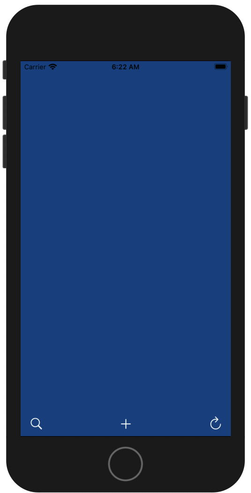

# Swifts-30-Projects - 12




세개의 클래스가 존재한다. 홈 화면인 `MainViewController`, 모달 화면인 `MenuViewController` , transition을 정의해둔 `TransitionManager`.

## Main.storyboard


두개의 ViewController를 확인할 수 있다. 화면 전환 시, `Present Modally` 로 설정되어있어, 모달 창처럼 표시된다.

## MainViewController

MainViewController에 코드로 구현 된것은 딱히 없고, `@IBAction` 이 하나 존재한다. 하지만 스토리보드에 연결되어 있지 않은 것을 확인했다. MainViewController에서, 다른 기능은 정의 되지 않았고, 하단 toolbar 중 + 버튼을 클릭시 segue를 통해 modal 화면이 표시되는 것만, Interface Builder를 통해 구현되었다.

## MenuViewController

위 `MainViewController`에서 + 버튼 클릭시 표시되는 화면이다.

해당 `ViewController`의 `transitioningDelegate` 로 `TransitionManager` 의 인스턴스가 할당되었다.

`transitioningDelegate` 는 `UIViewControllerTransitioningDelegate` 타입이다.

## TransitionManager

`MenuViewController`에서 화면을 닫고 `MainViewController`로 전환될 때 효과를 구현하였다.

`UIViewControllerAnimatedTransitioning`, `UIViewControllerTransitioningDelegate` 두개의 프로토콜을 채택하였다.

## 진행 흐름

present / dismiss 일 때, `ViewController`에 할당되어 있는 `transitionDelegate` (`TransitionManager`)에게 명령을 내린다. 해당 프로퍼티는 `UIViewControllerTransitioningDelegate` 프로토콜이 채택되었다.

애니메이션 호출이 필요할때, `dissmiss`/ `present` 에 따라 `Animator` 객체를 반환한다. `Animator` 객체는 `UIViewControllerAnimatedTransitioning` 프로토콜을 채택한다. 이어 해당 객체에서 애니메이션을 수행한게된다.

 애니메이션을 수행할 때에 호출된 것이, `animateTransition(using:)` 함수이다.

## extension TransitionManager: UIViewControllerAnimatedTransitioning

### func animateTransition(using:)

애니메이션 효과를 정의하는 함수이다. 해당 함수는 MenuViewController 창을 닫을 때 호출되는 것을 확인하였다.

tuple로 from, to 두개의 값이 사용된다. UIViewController 두개가 사용된다. 

```swift
func animateTransition(using transitionContext: UIViewControllerContextTransitioning) {
    let container = transitionContext.containerView
    
    // create a tuple of our screens
    let screens : (from:UIViewController, to:UIViewController) =
      (transitionContext.viewController(forKey: .from)!, transitionContext.viewController(forKey: .to)!)
    
    // assign references to our menu view controller and the 'bottom' view controller from the tuple
    // remember that our menuViewController will alternate between the from and to view controller depending if we're presenting or dismissing
    let menuViewController = !self.presenting ? screens.from as! MenuViewController : screens.to as! MenuViewController
    let bottomViewController = !self.presenting ? screens.to as UIViewController : screens.from as UIViewController
    
    let menuView = menuViewController.view
    let bottomView = bottomViewController.view
    
    // prepare the menu
    if (self.presenting){
      // prepare menu to fade in
      offStageMenuController(menuViewController)
    }
    
    // add the both views to our view controller
    container.addSubview(bottomView!)
    container.addSubview(menuView!)
    
    let duration = self.transitionDuration(using: transitionContext)
    
    UIView.animate(withDuration: duration, delay: 0.0, usingSpringWithDamping: 0.7, initialSpringVelocity: 0.8, options: [], animations: {
      
      if (self.presenting){
        self.onStageMenuController(menuViewController) // onstage items: slide in
      }
      else {
        self.offStageMenuController(menuViewController) // offstage items: slide out
      }
      
      }, completion: { finished in
        transitionContext.completeTransition(true)
        UIApplication.shared.keyWindow?.addSubview(screens.to.view)
        
    })
  }
```

from: 이전 뷰, 사라질 뷰

to: 이후 뷰, 나타날 뷰

`isPresenting` 상태에 따라, menuViewController와 bottomViewController를 가져온다.

화면 전환 효과들을 담을 containerView에 추가한 다음, `UIView.animate` 를 이용해 애니메이션을 만든다.

애니메이션이 끝난 뒤, `transitionContext.completeTransition` 메서드를 이용해 전환이 종료되었음을 알린다.

### func transitionDuration(using:?) -> TimeInterval

transition 효과에 걸리는 시간을 반환한다.

### func offStage(_ amount: CGFloat) -> CGAffineTransform

매개변수 amount 만큼의 `CGAffineTransform` 인스턴스를 반환한다.

### func offStageMenuController(_ menuViewController: MenuViewController)

MenuViewController를 전환할 때 사용한다. view의 alpha를 0으로 만들고, ViewController.view 내부 

subview 들의 transform을 `CGAffineTransform` 인스턴스로 할당한다.

### func onStageMenuController(_ menuViewController: MenuViewController)

transition을 주었던 MenuViewCotnroller의 subview 들의 위치를 원래대로 되돌린다.

## extension TransitionManager: UIViewControllerTransitioningDelegate

### func animationController(forPresented:, presenting:, source:) -> UIViewControllerAnimatedTransitioning?

해당 `ViewController`가 present 되었을 때 호출됩니다. `presenting`의 상태를 변경한다.

### func animationController(forDismissed:) -> UIViewControllerAnimatedTransitioning?

해당 `ViewController`가 dissmiss 되었을 때 호출됩니다. `presenting`의 상태를 변경한다.

---

## Ref

- UIViewController Non Interactive Transition: [https://hucet.tistory.com/17](https://hucet.tistory.com/17)