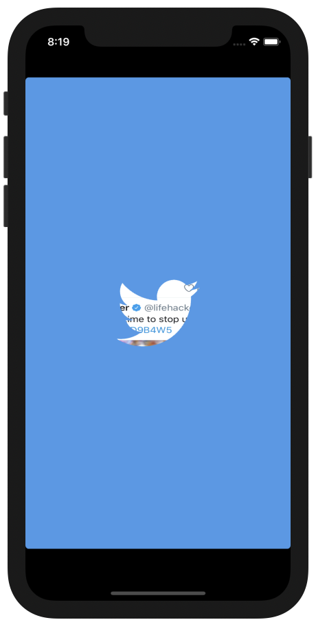

# Swifts-30-Projects - 13



앱 시작 시 애니메이션을 보여주는 애플리케이션이다. 

`AppDelegate` 파일 하나만 단독으로 존재한다. 오른쪽 사진에 트위터는 트위터모습을 캡처한 이미지이다.

## AppDelegate

### func application(_:, didFinishLaunchingWithOptions:) -> Bool

```swift
func application(_ application: UIApplication, didFinishLaunchingWithOptions launchOptions: [UIApplication.LaunchOptionsKey: Any]?) -> Bool {
    window = UIWindow(frame: UIScreen.main.bounds)

    if let window = window {
      // add background imageView
      imageView = UIImageView(frame: window.frame)
      imageView!.image = UIImage(named: "twitterScreen")
      window.addSubview(imageView!)
      imageView?.translatesAutoresizingMaskIntoConstraints = false

      // set up mask
      mask = CALayer()
      mask?.contents = UIImage(named: "twitterBird")?.cgImage
      mask?.position = window.center
      mask?.bounds = CGRect(x: 0, y: 0, width: 100, height: 80)
      imageView!.layer.mask = mask
      
      animateMask()
      
      // make window visible
      window.rootViewController = UIViewController()
      window.backgroundColor = UIColor(red: 70/255, green: 154/255, blue: 233/255, alpha: 1)
      window.makeKeyAndVisible()
    }
    
    return true
  }
```

애플리케이션이 시작 되기 전 설정이 끝났을때, 준비가 되고서 호출되는 함수이다. 

대부분 앱 초기 설정을 해당 함수 내부에서 정의하게된다. 이미지뷰를 생성하고, `window`의 `subview`로 추가한다. 그리고 `CALayer`를 생성하는데, `CALayer`가 무엇일까...

CA가 앞에 붙은 것은 `Core Animation` 을 의미한다. `Core Animation` 모듈 내의 Layer 객체라고 생각하면 될 것이다. 해당 객체는 이미지 베이스의 컨텐츠를 관리하고 애니메이션을 수행할 수 있도록 한다고 설명되어 있다. 

`CALayer.contents` 에 사용할 content가 포함되고, `CALayer.position` , `CALayer.bounds` 에 각각 position, bounds 가 할당된다.

`imageView` 의  layer를 새로 생성한 `CALayer`의 인스턴스로 설정한다. 

애니메이션 동작에 관한 부분은 `animateMask` 함수에서 구현하였고, 이것을 호출하였다.

### func animateMask()

```swift
func animateMask() {
    // init key frame animation
    let keyFrameAnimation = CAKeyframeAnimation(keyPath: "bounds")
    keyFrameAnimation.delegate = self
    keyFrameAnimation.duration = 1
    keyFrameAnimation.beginTime = CACurrentMediaTime() + 1
    
    // animate zoom in and then zoom out
    let initalBounds = NSValue(cgRect: mask!.bounds)
    let secondBounds = NSValue(cgRect: CGRect(x: 0, y: 0, width: 80, height: 64))
    let finalBounds = NSValue(cgRect: CGRect(x: 0, y: 0, width: 2000, height: 2000))
    keyFrameAnimation.values = [initalBounds, secondBounds, finalBounds]
    
    // set up time interals
    keyFrameAnimation.keyTimes = [0, 0.3, 1]
    
    // add animation to current view
    keyFrameAnimation.timingFunctions = [CAMediaTimingFunction(name: CAMediaTimingFunctionName.easeInEaseOut), CAMediaTimingFunction(name: CAMediaTimingFunctionName.easeOut)]
    mask!.add(keyFrameAnimation, forKey: "bounds")
  }
```

`CAKeyframeAnimation` 을 이용해 드로잉을 처리한다. `AppDelegate`에서  `CAAnimationDelegate` 을 채택했기 때문에, `keyFrameAnimation.delegate` 를 self 로 한다.

움직임을 끊어 `keyFrameAnimation.values` 에 담는다. `keyFrameAnimation.keyTimes` 는 해당 `keyFrameAnimation.values` 들의 시간 비율을 정의한다.

 

`keyFrameAnimation.timingFunctions` 에서는 `keyFrameAnition`의 `value` 간 전환 시에 속도를 설정하는데, `CAMediaTimingFunction` 클래스에 정의되어 있는 두가지를 사용하였다.

마지막으로 `mask`(`CALayer`)에 애니메이션을 추가한다. 

### func animationDidStop(_:, finished:)

`CAAnimationDelegate` 에 선언되어 있으며, 애니메이션 종료 시 호출된다. 

imgaView의 layer를 비워준다.

---

# Core Animation

이전의 프로젝트에서는 화면을 전환할 때에 `UIView.animate` 와 같은 함수를 많이 사용했다.

`UIView`에서는 `CGAffineTransform` 과 같은 `transform`을 이용하거나, `draw` `frame`, `bounds` 등을 이용하여 애니메이션을 처리한다. 

또 다른 방법으로는 현재 사용된 방법과 같이 layer-based 로 화면을 변경하는 것인데, 이것이 리소스에서의 장점이 있다.

View를 처리하는 것은 main 쓰레드에서 이루어 지고 draw를 새로 호출해 주어야 하기 때문에 비용이 높은데, layer를 처리하는 것은 비트맵을 캡처하여 드로잉 작업을 하드웨어에 전달하기 때문에 상대적으로 비용이 적다.


---

## Ref

- UIWindow: https://medium.com/@Alpaca_iOSStudy/uiwindow-5e7a9d72c582
- Core Animation Basic: https://developer.apple.com/library/archive/documentation/Cocoa/Conceptual/CoreAnimation_guide/CoreAnimationBasics/CoreAnimationBasics.html#//apple_ref/doc/uid/TP40004514-CH2-SW3
- CALayer Tutorial for iOS: Getting Started: https://www.raywenderlich.com/10317653-calayer-tutorial-for-ios-getting-started

