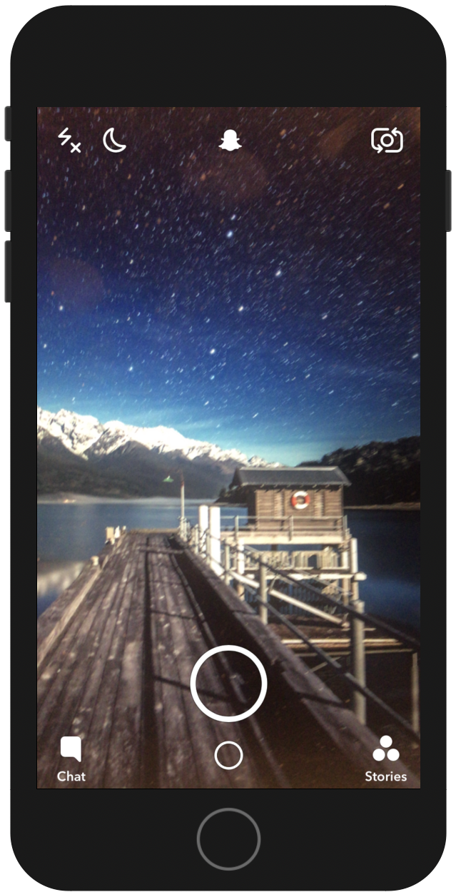

# Swifts-30-Projects - 15



`UIPageViewController`와 같이 가로로 페이지를 넘기며 화면을 볼 수 있는 애플리케이션이다.

`PageViewController`로 감싸져 있는 형태는 아니고, 스크롤 뷰를 통해 구현이 되었으며, 스크롤 뷰 내부에는 각 페이지에 해당하는 `ViewController` 가 `childViewController`로 속해있는 상태이다.

Main.stroyboard 에는 scrollView 하나만 그려져 있고, 각 페이지에 해당하는 ViewController도 큰 내용이 없고 이미지로 이루어져 있다.

## ViewController

먼저 열거형을 선언한다. 

```swift
enum vcName: String {
    case chat = "ChatViewController"
    case stories = "StoriesViewController"
    case discover = "DiscoverViewController"
  }
```

사용할 ViewController 들의 이름을 rawValue로 정의해 두었다. 해당 string은 xib 파일의 이름이다. 

```swift
override func viewDidLoad() {
    super.viewDidLoad()
    
    /// Create view controllers and add them to current view controller.
    let chatVC = UIViewController(nibName: vcName.chat.rawValue, bundle: nil)
    let storiesVC = UIViewController(nibName: vcName.stories.rawValue, bundle: nil)
    let discoverVC = UIViewController(nibName: vcName.discover.rawValue, bundle: nil)
    add(childViewController: chatVC, toParentViewController: self)
    add(childViewController: storiesVC, toParentViewController: self)
    add(childViewController: discoverVC, toParentViewController: self)
    
    /// Set up current snap view.
    let snapView = UIImageView(image: UIImage(named: "Snap"))
    changeX(ofView: snapView, xPosition: view.frame.width)
    scrollView.addSubview(snapView)
    
    /// Move stories and discover view to the right screen.
    changeX(ofView: storiesVC.view, xPosition: view.frame.width * 2)
    changeX(ofView: discoverVC.view, xPosition: view.frame.width * 3)
    
    /// Set up contentSize and contentOffset.
    scrollView.contentSize = CGSize(width: view.frame.width * 4, height: view.frame.height)
    scrollView.contentOffset.x = view.frame.width
  }
```

사용할 `UIViewController` 인스턴스를 nib이름으로 생성한다. 각 `nib`은 `imageView`만으로 이루어져 있다. 

정의한 `add`함수를 이용해 하위에 `ViewController`들을 추가한다. 홈 화면을 `UIImageView`로 표시하고, `changeX` 함수를 이용해서 위치를 지정한다. `changeX` 함수를 이용하여 `add`로 추가했던 화면들의 위치를 설정하고, 크기를 설정한다. 

### func changeX(ofView view: UIView, xPostition: CGFloat)

```swift
fileprivate func changeX(ofView view: UIView, xPosition: CGFloat) {
    var frame = view.frame
    frame.origin.x = xPosition
    view.frame = frame
  }
```

`frame` 의 위치를 변경시키는 `changeX` 함수이다.

### func add(childViewController: UIViewController, toParentViewController parentViewController: UIViewController)

```swift
fileprivate func add(childViewController: UIViewController, toParentViewController parentViewController: UIViewController) {
    addChild(childViewController)
    scrollView.addSubview(childViewController.view)
    childViewController.didMove(toParent: parentViewController)
}
```

UIViewController를 컨테이너로써 하위에 뷰들을 추가하여 부모 - 자식 관계로 이용하기 위해 설정하는 함수이다.