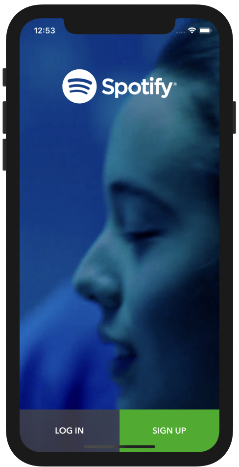

# Swifts-30-Projects - 16



Spotify 앱의 초기 화면을 구현한 프로젝트이다. 

## Storyboard


각각 `LaunchScreen.stroyboard`, `Main.storyboard` 이다.

왼쪽은 `LaunchScreen.storyboard` 는 초기 화면으로 앱 처음 시작시 보여지는 화면이다.

오른쪽은 `Main.storyboard` 로 처음 보여지는 화면 이후에 보여진다. 배경으로 영상이 재생된다. 

## VideoCutter

영상을 재생할때 사용되는 클래스이다. `cropVideoWithUrl` 메서드 하나만 존재한다.

```swift
open func cropVideoWithUrl(videoUrl url: URL, startTime: CGFloat, duration: CGFloat, completion: ((_ videoPath: URL?, _ error: NSError?) -> Void)?) {
    DispatchQueue.global().async {
      let asset = AVURLAsset(url: url, options: nil)
      let exportSession = AVAssetExportSession(asset: asset, presetName: "AVAssetExportPresetHighestQuality")
      let paths: NSArray = NSSearchPathForDirectoriesInDomains(.documentDirectory, .userDomainMask, true) as NSArray
      var outputURL = paths.object(at: 0) as! String
      let manager = FileManager.default
      do {
        try manager.createDirectory(atPath: outputURL, withIntermediateDirectories: true, attributes: nil)
      } catch _ {
      }
      outputURL = outputURL.convert.appendingPathComponent("output.mp4")
      do {
        try manager.removeItem(atPath: outputURL)
      } catch _ {
      }
      if let exportSession = exportSession as AVAssetExportSession? {
        exportSession.outputURL = URL(fileURLWithPath: outputURL)
        exportSession.shouldOptimizeForNetworkUse = true
        exportSession.outputFileType = AVFileType.mp4
        let start = CMTimeMakeWithSeconds(Float64(startTime), preferredTimescale: 600)
        let duration = CMTimeMakeWithSeconds(Float64(duration), preferredTimescale: 600)
        let range = CMTimeRangeMake(start: start, duration: duration)
        exportSession.timeRange = range
        exportSession.exportAsynchronously { () -> Void in
          switch exportSession.status {
          case AVAssetExportSessionStatus.completed:
            completion?(exportSession.outputURL, nil)
          case AVAssetExportSessionStatus.failed:
            print("Failed: \(String(describing: exportSession.error))")
          case AVAssetExportSessionStatus.cancelled:
            print("Failed: \(String(describing: exportSession.error))")
          default:
            print("default case")
          }
        }
      }
      DispatchQueue.main.async {
      }
    }
  }
```

URL을 가져온다던가 하는 작업은 메인 스레드에서 수행 시 블로킹을 유발할 수 있기 때문에 `DispatchQueue.global()` 로 다른 스레드에서 수행한다.

`AVURLAsset` 클래스를 이용해 `URL`에서 AVAsset을 가져온다. 가져온 Asset을 `AVAssetExportSession` 클래스를 이용하여 트랜스 코딩을 위한 세션을 생성한다. 

`NSSearchPathForDirectoriesInDomains` 클래스를 이용해 앱 내의 사용할 비디오의 경로를 가져온다.

비디오의 경로와 output 경로를 URL 을 이용해 설정하고 파일 타입을 지정한다. 

비디오의 시작 / 종료 시각을 `CMTimeRangeMake` 인스턴스로 생성하고, 비동기로 트랜스 코딩을 시작한다. 

## VideoSplashViewController

영상 재생을 제어할 `AVPlayerViewController` 인스턴스를 선언한다.

소리 크기, 재생중인 시간, player의 alpha 값 등에 대한 정보를 담을 프로퍼티를 선언한다. 변수의 값이 설정되면 `didSet` 을 통해 `AVPlayerViewController` 인스턴스가 가지고 있는 영상에 대한 속성을 변경한다. `fillMode` 프로퍼티를 통해서 `videoGravity` 값을 변경한다. 화면을 어떠한 방식으로 표시할지를 설정한다. (`resizeAspect`,  `resizeAspectFill`) 

`Notification`을 통해 비디오가 끝났을때 반복 재생할 수 있도록 구현하였다.

### viewDidAppear


화면의 구조를 보면 `AVPlayerView`가 뒤에 있는 것을 확인할 수 있다. 실제화면에서도 영상은 다른 이미지나 버튼의 뒤에 위치해있다.

 `sendSubviewToBack` 메서드를 통해 비디오 뷰를 같은 레벨의 다른 뷰들보다 뒤로 보내는 것을 볼 수 있다. 조작 화면 또한 표시되지 않도록 한다.

### viewWillDisappear

반복재생을 위해 등록했던 `Notification`을 제거한다.

### setMoviePlayer(_ url: URL)

이전에 구현했던 `VideoCutter` 클래스를 이용해 영상을 자르고, completion을 통해 자른 영상을 `AVPlayerViewController` 클래스에 할당해 재생한다.

### @objc func playerItemDidReachEnd()

영상 재생이 완료되고, `NSNotification.Name.AVPlayerItemDidPlayToEndTime`  Notificaiton을 옵저빙 하여 호출된다. 영상을 처음부터 재생한다. ( 반복 재생 )

## MasterViewController

위에 구현했던 `VideoSplashViewController`를 상속받아 구현한 클래스이다. 

배경을 설정하는 `setupVideoBackground()` 함수만 존재한다.

### func setupVideoBackground()

video `frame` 을 화면과 맞추고, `fillMode`를 설정한다.

항상 반복하도록 하고, 시작 시간과 `alpha` 값을 설정한다.