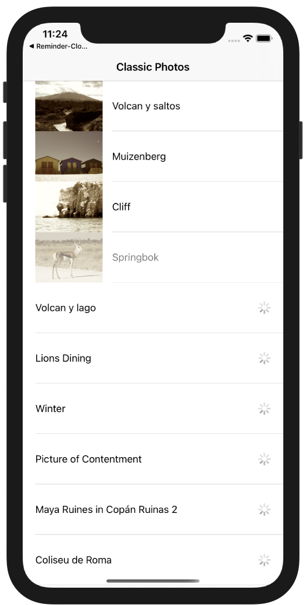

# Swifts-30-Projects - 17

이미지 목록과 이미지를 다운로드 받아 가져오는 애플리케이션이다.

ViewController 하나와, Model 하나가 존재한다.

## Stroyboard

하나의 화면으로 이루어져 있다. 셀 종류도 한가지이다.

## PhotoOperations

`PhotoRecord`, `PendingOperations`, `ImageDownloader`, `ImageFiltration` 클래스가 존재한다.

### PhotoRecord

가져올 사진의 이름과, 링크, 이미지 데이터를 담을 클래스이다.

이름, url, 상태, 이미지를 프로퍼티로 사용한다. 

### PendingOperations

두개의 큐를 가지고 있는 클래스이다. 먼저 다운로드 큐는 `[IndexPath:Operation]` 의 형식의 딕셔너리로 구성되어 있으며, "Download queue" 라는 이름으로 `OperationQueue` 인스턴스를 가지고 있다. 

이미지를 필터링 operation을 소유라는 딕셔너리 형식의 `[IndexPath:Operation]` 이미지를 처리하는 대기열을 가지고 있다. "Image Filtration queue"라는 이름의 `OperationQueue` 인스턴스를 가지고 있다.

### ImageDownloader

`Operation`을 상속받아 다운로드 진행 과정을 처리하는 클래스이다. 해당 인스턴스는 `OperationQueue` 에 처리를 맡길 것이다. 

이미지를 다운로드 받기 위해 이미 정보를 갖는 `PhotoRecord` 인스턴스 하나를 프로퍼티로 갖는다. 

`Operation` 클래스를 상속받아 구현된 클래스이기 때문에 `main` 함수에 동작할 내용이 정의되어 있다. `Data` 클래스를 이용하여 초기화를 진행한 후, 해당 URL 의 이미지 주소로 데이터를 가져오도록 시도한다. 성공 / 실패의 여부에 따라 다른 이미지가 사용된다.

### ImageFiltration

`Operation`을 상속받아 이미지를 처리하는 과정을 수행하는 클래스이다. 

마찬가지로 이미지는 `PhotoRecord` 클래스의 인스턴스를 사용한다. 

`applySepiaFilter` 함수가 정의되어 있다. `UIImage`를 입력받아 `CIImage`(Core Image 모듈의 이미지 클래스)로 가져온 뒤, `CIFilter`를 이용해 세피아 처리를 하여 `UIImage`를 반환하는 함수이다. 

해당 클래스의 main 함수에서는 `photoRecord` 프로퍼티의 `state` 값을 이용해 상태를 확인한 후, 이미지를 변환하도록 함.

## ListViewController

`UITableViewController`를 상속받아 구현한 클래스이다.

### fetchPhotoDetails

사진을 웹에서 받아오는 함수이다. 

URLRequest 클래스를 이용해 request 인스턴스를 생성하고, `NSURLConnection.sendAsynchronousRequest` 함수를 이용하여 요청 작업을 수행한다. 실패 시에 `UIAlertView`를 표시한다.

다운로드 받은 데이터는 `plist` 이므로 `PropertyListSerialization` 을 이용해서 가져올 파일 목록을 딕셔너리 타입으로 변환한다.  

딕셔너리의 key(name) - value(url)을 이용해 `PhotoRecord` 인스턴스로 생성하여 클래스의 배열에 저장한다.

### func startOperationsForPhotoRecord(photoDetails: PhotoRecord, indexPath: IndexPath)

`PhotoRecord` 타입과 `IndexPath`를 인자로 받는 함수이다. 

상태에 따라 `.New` 일 경우 `startDownlaodForRecord` 메서드를 실행시켜 다운로드를 시작하고, 

`Downloaded` 일 경우 `startFiltrationForRecord` 필터링을 수행한다.

### func startDownloadForRecord(photoDetails: PhotoRecord, indexPath: IndexPath)

`PhotoRecord` 를 인스턴스로 받아 `completionBlock`을 지정한 후 `downloadQueue`에 추가하는 함수이다. 

다운로드가 진행중인 상태를 저장해둔 `pendingOperations.downloadsInProgress` 을 확인해서 값이 존재하면 함수를 종료한다.

`Operation`의 구현체인 `ImageDownloader` 클래스를 이용해 이미지를 다운로드 받는다. 이미지가 다운로드가 완료되었을 때를 구현하기 위해 `main` 함수가 실행된 이후의 동작을 설정한다. `downloadsInProgress` 에 저장되어있던 대기열을 제거하고, `downloadQueue`에 해당 `ImageDownloader` 인스턴스를 추가한다.

### func startFiltrationForRecord(photoDetails: PhotoRecord, indexPath: IndexPath)

전달받은 `PhotoRecord` 를 인스턴스로 받아 `completionBlock`을 지정한 후 `filtrationQueue` 에 추가하는 함수이다.

다운로드가 진행중인 상태를 저장해둔 `pendingOperations.filtrationsInProgress` 을 확인해서 값이 존재하면 함수를 종료한다.

세피아 필터 작업을 수행하는 `ImageFiltration` 클래스에 `completionBlock`을 설정한다. `filtrationsInProgress` 배열에 값을 제거하고, `filtrationQueue`에 `ImageFiltration` 인스턴스를 추가한다. 

### override func tableView(_:,cellForRowAt:) -> UITableViewCell

`tableView.dequeueReusableCell` 을 이용해 재사용할 셀을 불러온다. 

먼저 `accessoryView`를 설정한다. `UIActivityIndicatorView` 를 이용해 로딩중임을 표시한다. 

`PhotoRecord` 인스턴스를 배열에서 받아와 text, image를 설정한다. `PhotoRecord` 인스턴스의 state에 따라 `UIActivityIndicatorView`의 애니메이션을 수행 / 종료한다. 

### func scrollViewWillBeginDragging(_:)

함수의 이름 그대로 스크롤 뷰가 시작될 때 호출된다. OperatoinQueue에 추가해둔 큐들을 일시 정지하는 `suspendAllOperations` 함수를 호출한다.

### func scrollViewDidEndDragging(_:,willDecelerate:)

드래그가 끝나면 호출되는 함수이다.

드래그가 끝나고 움직임이 멈추면, 현재 이미지를 로딩하는 `loadImagesForOnscreenCells` 함수와`Operation`을 다시 재개하는 `resumeAllOperations` 함수를 호출한다. 

### func scrollViewDidEndDecelerating(_:)

스크롤이 전부 끝나고 나서 호출되는 함수이다. 

위와 동일하게 `loadImagesForOnscreenCells()`, `resumeAllOperations()` 두개의 함수를 호출한다. 

### suspendAllOperations()

사용되는 두개의`OperationQueue.isSuspended`를 true로 지정한다.

### resumeAllOperations()

사용되는 두개의 `OperationQueue.isSuspended`를 false로 지정한다.

### func loadImagesForOnscreenCells()

현재 표시되는 위치의 데이터를 우선적으로 로딩하도록 처리하는 함수이다.

현재 plist를 fetch 하여 serialization된 딕셔너리의 키를 모두 받아온다. (download, filtration)

현재 보이는 `IndexPath`들을 확인하여 보이지 않는 나머지 셀들의 `Operation`을 cancel 한다.

보이는 `IndexPath` 에 해당하는 데이터들은 모두 `startOperationsForPhotoRecord` 에 매개변수로 담아 호출한다.