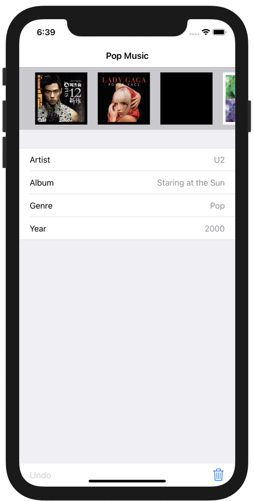

# Swifts-30-Projects - 18

상단 스크롤 뷰에 앨범 자켓 이미지를 받아오는 프로그램이다.

17번 프로젝트와 동일하게 이미지를 main 쓰레드가 아닌 다른 쓰레드에서 받아오기 때문에 

이미지 로딩에서 Blocking 이 생기지 않는다. 

API, Views, Controllers, Models, Helper 그룹으로 구성되어 있다.

## storyboard

상단에 가로 방향의 스크롤 뷰 하나 존재하고, 그 아래에는 테이블 뷰가 존재한다.

## PersistencyManager

이미지를 읽고 쓰기위해 사용되는 클래스이다.

`FileManager` 클래스를 이용해 `cache`, `documents` 를 이용한다. 

`iOS` / `MacOS` 에서는 경로를 `URL` 객체를 이용해 나타낸다. 

그리고 파일 내부의 경로를 나타낼 때, 도메인 단위로 표시한다. 도메인은 `userDomainMask`, `localDomainMask`, `networkDomainMask`, `systemDomainMask` 가 있다. 

### init()

해당 클래스가 생성될 때에, 초기화 단계에서 json 파일에서 데이터를 가져온다. 데이터를 가져올때, 먼저 documents 경로에 존재하는지 확인하고, 없으면 Bundle.main에서 데이터를 받아온다. 가져온 데이터를 `JSONDecoder` 를 이용해 `Album` 타입의 배열로 디코딩을 수행한다.

이후 객체 내부의 albums 프로퍼티에 저장하고, 이것을 인코딩하여 저장한다. 

### saveAlbums()

객체 내부의 `albums` 프로퍼티를 `JSONEncoder` 를 이용해 인코딩 한 뒤, `userDomain` 내부 `documentDirectory` 에 `albums.json` 파일을 저장한다.

### func addAlbum(_ album: Album, index: Int)

albums 개수를 확인해 앞에 index를 추가하거나, 뒤에 append한다.

### func deleteAlbumAtIndex(_ index: Int)

`albums` 내부 해당 index의 값을 제거한다. 

### func saveImage(_ image: UIImage, filename: String)

파라미터로 받은 `image`를 `filename` 경로에 저장한다. 

저장되는 경로는 `userDomain` 내부 `cacheDirectory`에 저장하다. 

### func getImage(with filename: String) -> UIImage?

`cacheDirectory`에 `filename`에 해당하는 파일을 가져와 반환한다.

## HTTPClient

### func downloadImage(_ url: String) -> (UIImage)

인자로 받은 문자열을 이용해 `URL` 객체를 생성하고, `Data` 클래스로 이미지를 다운로드 받아 반환한다. 

## LibraryAPI

`shraedInstance` 라는 이름의 변수로 singleton pattern을 사용한다. 

변수로 위에서 정의하였던 `HTTPClient`, `PersistencyManager` 클래스의 인스턴스를 사용한다. 

`NotificationCenter`를 이용해 이미지를 다운로드 받도록 옵저버를 추가한다.

### func addAlbum(_ album: Album, index: Int)

`persistencyManager` 프로퍼티 내부 배열에 `album`을 추가하는 메서드이다.

`isOnline` 일 경우 `httpClient`를 이용해 `postRequest`를 전송한다.

### func deleteAlbum(_ index: Int)

`persistencyManager` 프로퍼티 내부 배열에 해당 index에 해당하는 `album`을 제거하는 메서드이다.

`isOnline` 일 경우 `httpClient`를 이용해 `postRequest`를 전송한다.

### @objc func downloadImage(_ notification: Notification)

`Notification` 발생 시 호출되는 함수이다.

`notification.userInfo`를 이용해 imageView와 `coverUrl`, `filename` 을 받아온다.

`persistencyManager`를 이용해 이미지를 받고, 이것을 `imageView`에 할당한다.

가져오는 데에 실패하면 `httpClient`를 이용해 이미지 다운로드를 시도한다. 이후 image를 할당하고, `persistencyManager` 를 이용해 이것을 `cacheDirectory` 에 저장한다. 

## Model

앨범에 대한 이미지 / 정보를 저장할 클래스이다. 

`CustomStringConvertible` 프로토콜을 이용해 객체에 대한 `description`을 정의하였다.

`computed property` 로 `tableRepresentation` 튜플 타입의 배열을 사용한다.

## AlbumView

상단 이미지 뷰들로 이루어진 스크롤에서 사용되는 `UIView` 의 구현체이다.

`init` 시에 진행되는 `commonInit()` , `highlightAlbum(_ didHighlightView: Bool)`  두개의 함수로 구현되어 있다. 

### init()

초기 레이아웃을 설정하는 commonInit() 함수를 호출하고, NotificaitonCenter 를 이용해 userInfo 에 이미지 뷰와 링크에 대한 데이터를 담아 전송한다. 

`userInfo`에 `imageView`, `coverUrl` 을 담아서 전달한다.  해당 `Notification`을 수신한 상대는 `imageView` 의 image 를 설정한다. 

### commonInit()

초기 레이아웃 및 뷰를 설정하기 위한 함수이다.

`UIImageView`, `UIIndicator`, `LayoutConstraint` 등을 설정한다.

Key-Value Observing을 이용해 `coverImageView`가 변경될 때, `indicatorView` 의 animation을 중단한다. 

### func highlightAlbum(_ didHighlightView: Bool)

해당 `View`가 현재 highlight 된 `View`일때, backgroundColor를 바꿔주는 함수이다. 

## HorizontalScroller

protocol로 `HorizontalScorllerDataSource`, `HorizontalScrollerDelegate` 를 정의하였고, `HorizontalScrollerView` 에서 각 `delegate`, `dataSource`를 해당 프로토콜로 프로퍼티를 선언하였다. 

### initailizeScrollView

초기 스크롤 뷰 화면을 지정한다. 스크롤 뷰가 UIView 내부에 위치할 수 있도록 `LayoutConstraint` 를 지정하고, `UITapGestureRecognizer`를 추가한다. 

### didMoveToSuperview()

superview에서부터 이동되었을때 호출되는 함수이다. `reload()` 함수가 호출된다.

### func scrollToView(at index: Int, animated: Bool = true)

해당 index에 해당하는 뷰를스크롤 뷰에서의 가운데로 이동시켜주는 함수이다. 

`scroller.setcontentOffset` 메서드를 이용해 스크롤을 이동한다.

### @objc func scrollerDidTap(_ gesture: UITapGestureRecognizer)

스크롤 뷰를 터치시에 호출되는 메서드이다. 

`delegate.horizontalScrollerView`  함수를 실행하고, 스크롤을 해당 뷰로 이동시킨다.

### reload()

스크롤뷰를 다시 로딩하기 위한 함수이다.

사용하고 있는 뷰들을 `contentViews` 에 담아두는데, `removeFromSuperview` 함수를 호출하여 뷰들을 모두 제거한다. 

`dataSource`내부에 뷰들을 모두 가져와 추가하고 `CGRect`를 계산한다.

### centercurrentView()

현재 선택된 뷰의 인덱스를 구한 다음, 해당 가운데에 위치할 수 있도록 `scrollView`의 offset을 조정한다.

### func scrollViewDidEndDragging(_:,willDecelerate:)

스크롤뷰의 드래그가 종료될 때에 호출됨. `scrollvView`의 `offset`을 설정하는 `centerCurrentView` 함수를 호출한다. 

### func scrollViewDidEndDecelerating(_:)

스크롤이 속도가 줄어들며 스크롤이 완전히 멈췄을 때에 호출된다. 이때도 동일하게 `centerCurrentView` 함수를 호출하여 가운데로 위치시킨다.

## ViewController

## viewDidLoad

초기 설정을 진행한다. 위쪽의 horizontal `scrollview` 의 `delegate`, `dataSource`를 지정한다. `UserDefaults`에서 이전 설정을 불러오는 `loadPreviousState` 함수를 호출한다.

`UIToolbar`에 두개의 버튼을 생성하고 `action`을 지정한다. 각각 `undo`, `delete` 버튼이다.

Notification을 이용해 백그라운드로 진입할때, 현재 상태를 저장하는 `saveCurrentState` 함수를 호출한다.

### func showDataForAlbum(at index: Int)

앨범의 데이터를 표시하는 함수이다. index로 클래스 내부 `allAlbums` 프로퍼티의 album 객체를 가져와 `currentAlbumData`를 설정하고, 테이블 뷰를 다시 로드한다.

### @objc func saveCurrentState()

`UserDefaults` 를 이용하여 `currentAlbumIndex`를 저장한다. 

또 `LibraryAPI.sharedInstance.saveAlbums()` 함수를 호출하는데, `documentDirectory`에 인코딩된 `json` 데이터를 저장하는 함수이다.

### func loadPreviousState()

`UserDefaults`를 이용해 `currentAlbumIndex`를 가져오고, index에 맞게 album 정보를 설정한다.

### func reloadScroller()

앨범 정보를 모두 가져오고, `currentAlbumIndex`를 이용해 화면을 설정한다. 스크롤 뷰와 테이블 뷰를 다시 설정한다.

### func addAlbumAtIndex(_ album: Album,index: Int)

`LibraryAPI` 를 이용해 앨범 목록에 새로운 앨범을 추가한다.

### @objc func deleteAlbum()

`UIBarButtonItem` 중 삭제 버튼을 클릭했을 때 호출된다. `undoStack` 에 해당 앨범과 index를 추가한다.

`LibraryAPI` 내부에서 앨범을 삭제하는 함수를 호출하고, 스크롤 뷰를 다시 불러온다. 

`undo`버튼을 활성화 시키고, 앨범 개수에 따라 `delete`버튼을 활성화시킨다.

### func tableView(_:,cellForRowAt:) -> UITableViewCell

각 셀들이 어떻게 표시될 것인지를 결정한다. 

currentAlbumData에서 앨범 정보를 가져와 셀의 텍스트를 설정한다.

## extension ViewController: HorizontalScrollerDataSource

스크롤 뷰에서 delegate 패턴을 이용해 위임한 프로토콜이다.

### horizontalScrollerView(_ horizontalScrollerView: HorizontalScrollerView, viewAt index: Int) -> UIView

각 `AlbumView`클래스를 이용해 앨범 이미지를 설정한다.

## extension ViewController: HorizontalScrollerDelegate

스크롤 뷰에서 delegate 패턴을 이용해 위임한 프로토콜이다.

### func horizontalScrollerView(_ horizontalScrollerView: HorizontalScrollerView, didSelectViewAt index: Int)

스크롤 뷰에서 해당 뷰를 선택했을 때 호출된다.

스크롤 뷰의 스크롤을 이동시키고, highlight를 설정한다.(배경색 변경)

테이블 뷰의 데이터를 변경한다.