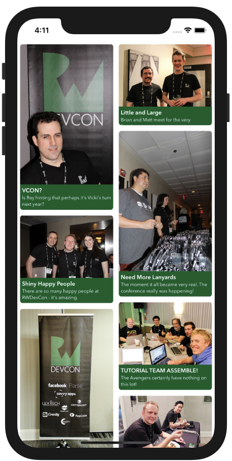

# Swifts-30-Projects - 19

각각 다른 높이로 이루어진 셀들로 구성된 컬렉션 뷰를 가진 화면이다.

Asset, Controllers, Extension, Layout, Model 등이 그룹으로 나누어져 있다.

## storyboard

`UICollectionViewController`로 이루어진 하나의 씬만 존재한다.

## Photo

사진에 대한 정보를 갖는 `Photo` 클래스이다. `caption`, `comment`, `image` 세개의 프로퍼티를 갖는다. 

`convenience init` 으로 딕셔너리를 이용하여 클래스를 초기화하는 방법도 구현해 두었다. 

### class func allPhotos() -> [Photo]

`Photos.plist` 에 존재하는 데이터를 읽어 딕셔너리로 이루어진 배열을 생성한다. 생성된 딕셔너리를 이용해 Photo 인스턴스를 만들고, 만들어진 배열을 반환한다.

### func heightForComment(_ font: UIFont, width: CGFloat) -> CGFloat

`boundingRect` 함수를 이용해 `comment` 문자열이 갖게될 크기를 지정한다.

## UIImage+Decompression

### var decompressedImage: UIImage

UIImage를 해제하여 반환하는 computed property이다. `UIGraphicsBeginImageContextWithOptions` 함수를 이용해 context를 생성하고, draw를 이용해 그린 후 `UIGraphicsGetImageFromCurrentImageContext` 를 이용해 context를 닫고, 이미지를 반환한다.

## RoundedCornersView

`CollectionViewCell` 내부에 존재하는 View이다. `@IBInspectable` 을 추가하여 Interface Builder에서도 해당 옵션을 설정할 수 있다.

## AnnotatedPhotoCell

`UICollectionView`에서 사용되는 셀의 구현체이다.

`didSet`을 통해 각 셀에 들어갈 정보를 가지고 있는 `Photo` 인스턴스가 할당될때, `image`, `caption`, `comment`를 설정한다. 

### override func apply(_:)

`UICollectionViewLayoutAttributes` 을 인자로 받는 함수이다. 

`layoutAttributes`를 확인하여 셀 내부의 이미지의 `heighAnchor`를 설정한다.

`UICollectionViewLayoutAttributes` 클래스는 레이아웃 프로세스 중에 컬렉션 뷰에 셀과 재사용 가능한 뷰를 표시하는 위치와 방법을 나타낼 때에 사용한다. 

`LayoutAttributes` 인스턴스에 담겨있는 높이 값을 이용하여 `imageView`의 `heightAnchor`를 지정한다.

## protocol PinterestLayoutDelegate

`UICollectionViewLayout` 을 구현한 `PinterestLayout` 에서, 일부 기능 구현을 위해 해당 프로토콜을 이용해 delegate 패턴을 사용한다. 두개의 함수가 존재한다.

**func** collectionView(**_** collectionView:UICollectionView, heightForPhotoAtIndexPath indexPath:IndexPath, withWidth:CGFloat) -> CGFloat

**func** collectionView(**_** collectionView: UICollectionView, heightForAnnotationAtIndexPath indexPath: IndexPath, withWidth width: CGFloat) -> CGFloat

## PinterestLayoutAttributes: UICollectionViewLayoutAttributes

내부 content들 (cell) 들의 레이아웃을 결정하는데 사용되는 요소이다. 

`UICollectionViewLayoutAttributes` 인스턴스는 레이아웃을 담당하는 속성에 대한 객체이다.

`copy` 메서드와 `isEqual` 메서드를 오버라이딩 하여 정의하였다. `photoHeight` 높이가 같은지 비교하여 반환한다.

## PinterestLayout: UICollectionViewLayout

`UICollectionView`의 레이아웃을 결정하는 `UICollectionViewLayout`을 subclassing한 객체이다.

cache 프로퍼티에 `PinterestLayoutAttributes` 인스턴스를 배열에 담음. contentHeight, contentWidth를 설정한다. 

### prepare

layout 객체가 현재 레이아웃을 업데이트 하기 전에 호출되는 함수이다. `UICollectionViewLayoutAttributes` 배열을 이곳에서 준비한다.

`collectionView`의 너비를 이용해 `columnWidth`를 구한다.

`xOffset`, `yOffset`을 구한다. offset에는 사용할 x, y의 데이터 값을 지정한다. 

사용자가 필요로 하는 데이터에 값을 대입하여 사용자가 무엇을 필요로 하는지 확인한다. 

모든 item 들에 대한 `indexPath`를 설정한다. 

`delegate`를 이용하여 image, annotation의 높이를 계산한다.

padding 을 고려하여 해당 frame의 위치와 차지할 영역을 계산한다. 

`UICollectionViewLayoutAttributes` 를 subclass한 `PinterestLayoutAttributes` 클래스를 이용해 각 indexPath의 frame 크기를 지정하고 이것을 cache에 추가한다.

전체 높이를 계산하여 frame의 `contentHeight`로 지정한다.

### override func layoutAttributesForElements(in rect: CGRect) -> [UICollectionViewLayoutAttributes]? {

모든 셀들에 대한 `LayoutAttributes` 배열을 반환해준다. 해당 attributes 내부에는 indexPath, frame, height 정보 등이 포함되어 있다.

인자인 rect 와 겹치는 요소를 찾아 반환해준다.

## PhotoStreamViewController

각 셀에 대한 정보(image, annotation)를 photos 프로퍼티에 저장한다.

`viewDidLoad` 에서 layout 객체의 delegate를 설정한다.

## extension PhotoStreamViewController : PinterestLayoutDelegate

`PinterestLayout`에서 `image`, `annotation`의 높이를 구하기 위한 함수들이다.

### **func** collectionView(**_** collectionView:UICollectionView, heightForPhotoAtIndexPath indexPath: IndexPath, withWidth width: CGFloat) -> CGFloat

indexPath를 이용해 해당 photo를 얻은 후, `AVMakeRect` 함수를 이용해 해당 이미지 비율의 적절한 길이를 계산하여 반환한다. 

### **func** collectionView(**_** collectionView: UICollectionView, heightForAnnotationAtIndexPath indexPath: IndexPath, withWidth width: CGFloat) -> CGFloat

annotation의 높이는 photo 인스턴스 내부의 `heightForComment` 함수를 이용해 문자열의 적절한 높이를 구한 후,  padding을 포함한 높이를 반환한다.