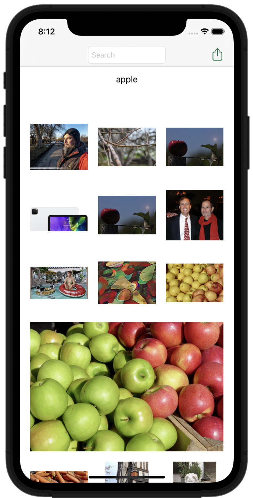

# Swifts-30-Projects - 20

flickr 에서 이미지를 검색해 결과를 보여주는 프로그램이다. 

`View`, `Controller`, Flickr 그룹이 존재한다.

## Storyboard

`UINavigationController`에 embed 된 `UIViewController` 하나 존재한다.

`UICollectionView`가 내부에 존재하고 셀이 하나 존재하는 것도 확인할 수 있다.

## Flickr

### func searchFlickrForTerm(_ searchTerm: String, completion : @escaping (_ results: FlickrSearchResults?, _ error : NSError?) -> Void

`flickSearchURLForSearchTerm` 함수를 이용해 `URL` 객체를 생성한다.

이후 `URL`을 이용해 `URLRequest`를 생성하고, 이것을 이용해 `dataTask`를 생성한다. `completionHandler`를 이용해서 데이터를 처리한다. `error`가 존재할 시에는 에러를 처리하고, `reponse`가 필요할 때에는 reponse를 처리한다. main OperationQueue에 추가하여 매개변수로 받은 클로저 `completion`을 처리한다.

받아온 data를 `JSONSerialization`을 이용해 딕셔너리 구조로 만들고, 만들어진 딕셔너리 key 중에서 stat을 이용해 ok, fail에 따라 에러처리를 수행한다.

딕셔너리에서 key가 Photos인 value를 가져오고, 여기에서 딕셔너리를 한꺼풀 더 벗긴다.

각각 사진에 해당하는 딕셔너리 객체를 `FlickrPhoto` 인스턴스로 만든 후, 이미지 데이터를 받아와 배열에 담는다.

마지막으로 OperationQueue에 검색어와 `FlickrPhoto` 배열을 프로퍼티로 갖는 `FlickrSearchResults` 인스턴스를 completion의 매개변수로 넘긴다.

### fileprivate func flickrSearchURLForSearchTerm(_ searchTerm:String) -> URL?

api key와 매개변수로 오는 검색어를 이용해 문자열 URL 객체를 만들어 반환하는 함수이다.

## FlickrPhoto

검색어를 이용해 받아온 딕셔너리 데이터를 이용해 각 사진에 대한 정보를 가지고 있는 클래스이다.

### func flickrImageURL(_ size:String = "m") -> URL?

프로퍼티에서 가지고 있는 정보를 이용해 이미지에 대한 `URL`을 생성해 반환하는 함수이다.

매개변수인 size 는 이미지의 사이즈를 의미한다.!

### func loadLargeImage(_ completion: @escaping (_ flickrPhoto:FlickrPhoto, _ error: NSError?) -> Void)

원본 이미지를 받아오는 함수이다. 

큰 사이즈의 이미지로 URL을 생성하고 생성한 URL로 리퀘스트를 생성하여 이미지 데이터를 받아온다.

데이터를 이용해 `UIImage`를 생성해 `completion`으로 전달한다.

### func sizeToFillWidthOfSize(_ size:CGSize) -> CGSize

클래스 내부에 있는 썸네일 프로퍼티를 이용해 비율을 계산하여 이미지 사이즈를 반환한다.

## FlickrPhotoCell

UICollectionViewCell을 상속받아 구현한 셀이다. `imageView`와 `activityIndicator`를 프로퍼티로 갖고 있다. `isSelected` 에 따라 `layer.borderWidth`를 변경한다.

## MainViewController

`UIViewController`이고, 내부에 `UICollectionView`를 갖는다. 

ViewController의 padding을 지정하고 사용할 이미지 배열을 지정한다.

검색어로 사용한 텍스트를 `UILabel`로 지정한다.

`searches`에 검색 기록 및 이미지 기록을 저장하고, 검색 기록 하나하나가 c`o`llectionView에서 `section`으로 구분되어 이루어져 있다.

`largePhotoIndexPath`는 셀을 선택시에 해당 셀의 이미지를 키우게 되는데, 이때 선택한 셀의 `indexPath`를 기리킨다. `largePhotoIndexPath`값이 변경되면, `collectionView`에서 아이템을 다시 로드하고, 스크롤을 현재 `largePhotoIndexPath`의 위치로 이동시킨다.

`sharing` 는 현재 공유모드인지 상태를 가지고 있는 프로퍼티이다.

`collectionView.allowsMultipleSelection` 을 변경하여 선택 가능한 상태를 변경하고, 현재 선택되어있는 셀을 모두 없애고, `selectedPhotos` 배열을 비운다.

`largePhotoIndexPath` 를 `nil` 로 두어 큰 이미지의 셀을 없앤다.

`updateSharedPhotoCount`를 호출해 `sharingDetailItem` 을 설정한다. (현재 선택된 셀의 개수를 표시함)

네비게이션바에 `shareButton`, `sharingDetailItem`을 할당한다.

### viewDidLoad

`collectionView`의 `dataSource`, `delegate`를 지정하고 컬렉션 뷰를 길게 눌렀을 때의 `handleLongGesture` 함수를 호출하는 `UILongPressGestureRecognizer`를 추가한다.  

### handleLongGesture

`gestrue.state`에 따라 `interactiveMovement`를 다르게 호출한다.

`collectionView`에서 레이아웃을 반응형으로 변경할 때에 해당 함수를 호출한다.

### shareButtonDidTap

공유버튼을 눌렀을 때에 호출된다. `sharing` 상태에 따라서 함수를 return 하거나 계속 진행한다.

선택된 이미지가 없을때는 함수를 return 한다.

`selectedPhotos` 배열의 각 `FlickrPhoto` 의 `thumbnail` 들을 `imageArray`에 추가한다.

`UIActivityViewController` 인스턴스를 생성하고, `completionHandler`로 클래스의 `sharing` 프로퍼티를 `false`로 전환한다. ( 공유모드를 끈다. )

이후 공유 화면을 표시한다.

### func collectionView(_ collectionView: UICollectionView, cellForItemAt indexPath: IndexPath) -> UICollectionViewCell

`collectionView`에서 각 셀의 내용을 표시할때 호출되는 함수이다.

`thumbnail`, `largeImage`를 설정한다.

`largeImage`를 로딩하기 위해 로딩 사이에 `activityIndicator` 애니메이션을 추가한다.

이미지 로딩이 완료되면 애니메이션을 멈추고 cell의 이미지를 `largeImage`로 교체하여 셀을 반환한다.

### **func** collectionView(**_** collectionView: UICollectionView, viewForSupplementaryElementOfKind kind: String, at indexPath: IndexPath) -> UICollectionReusableView

`UICollectionView`의 요소 중 supplementary view(header, footer) 를 제공할 때에 호출되는 함수이다. kind가 header일때에 text를 검색어로 지정하고 view를 반환한다.

### func collectionView(_ collectionView: UICollectionView, moveItemAt sourceIndexPath: IndexPath, to destinationIndexPath: IndexPath)

`collectionView` 내부의 요소를 옮길 때에 호출되는 메서드이다. 기존 `sourceResults` 에서 `sourceIndexPath` 요소를 제거하고, `destinationIndexPath` 요소를 추가한다.

### func collectionView(_ collectionView: UICollectionView, layout collectionViewLayout: UICollectionViewLayout, sizeForItemAt indexPath: IndexPath) -> CGSize

`collectionView`에서 각 셀의 `size`를 지정하는 함수이다.

view에서 가능한 너비를 구한 후에 padding을 제외한 가능한 사이즈를 계산하고, `sizeToFillWidthOfSize` 함수로 해당 이미지의 비율에 맞게 적절한 사이즈를 계산하여 반환한다.

### func collectionView(_ collectionView: UICollectionView, shouldSelectItemAt indexPath: IndexPath) -> Bool

해당 셀이 선택 가능한 상태인지를 지정한다. `sharing` 상태에 따라 ture / false가 나뉘고, `largePhotoIndexPath`에 해당하는 셀(현재 확대 화면인 셀)은 선택가능하도록 한다.

### func collectionView(_ collectionView: UICollectionView, didSelectItemAt indexPath: IndexPath)

셀을 선택할 때에 호출되는 함수이다.  `selectedPhotos` 배열에 추가하고, 선택된 이미지의 개수를 네비게이션 바에 업데이트 하는 `updateSharedPhotoCount` 함수를 호출한다. 

### func collectionView(_ collectionView: UICollectionView, didDeselectItemAt indexPath: IndexPath)

셀이 선택 해제되었을 때에 호출되는 함수이다. `selectedPhotos` 배열에서 해당 요소를 제거하고, `updateSharedPhotoCount` 함수를 호출한다.

## extension MainViewController: UITextFieldDelegate

### func textFieldShouldReturn(_ textField: UITextField) -> Bool

키보드에 return 키가 눌렸을 때에 입력이 완료 될때 호출되는 함수이다.

Activity Indicator 애니메이션을 동작하고, textField에 입력된 검색어를 `Flickr.searchFlickrForTerm` 의 매개변수로 넘기고 completionHandler로 Activity Indicator제거, 결과를 searches 배열에 추가, collectionView reload 작업을 수행한다. 

`textField`는 비운다.

### updateSharedPhotoCount

선택된 사진의 개수를 나타내는 `shareTextLabel`의 값을 변경하는 함수이다.

---

### Ref

- [https://hucet.tistory.com/20](https://hucet.tistory.com/20)