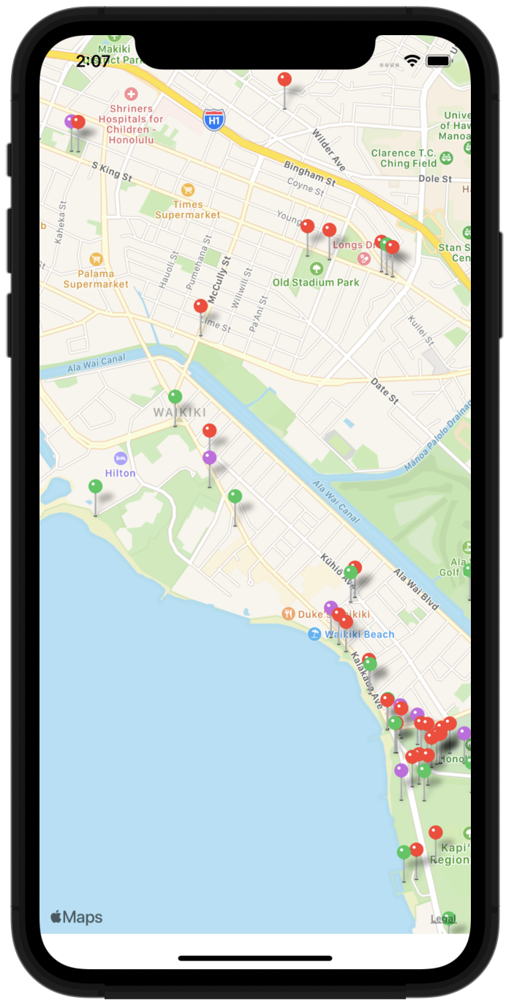

# Swifts-30-Projects - 22

지도에 public artwork 들의 위치를 마커를 찍어 표시하고 해당 마커를 선택하면 이름과 주소를 확인할 수 있는 어플리케이션이다.

Model, ViewController, View, Support 그룹이 존재한다. support 그룹

## JSON

`JSONValue`

열거형으로 구성되어 JSON 값을 관리하는 객체이다.1

computed 프로퍼티들이 존재하고 2가지로 subscript가 존재한다 (index로써 접근, key로써 접근)

static func 으로 객체에서 `JSONValue`를 꺼내는 코드도 존재한다.

`var object` , `var array`, `var interger`, `var double`, `var bool`

객체가 case(`.jsonObject`, `.jsonArray`, `.jsonString`, `.jsonNumber`, `.jsonBool`)에 해당하는 값을 경우 반환한다.

### subscript(i: Int) → JSONValue?

`.jsonArray` 인 경우, 배열의 i 번째 요소를 반환한다.

### subscript(key: String) → JSONValue?

`.jsonObject` 인 경우, 딕셔너리의 key를 이용해 얻은 value를 반환한다.

### static func fromObject(_ object: Any) → JSONValue?

딕셔너리로 이루어진 json 요소의 종류에 따라 `NSString`, `NSNumber`, `NSDictionary`, `NSArray` 요소를 처리한다. 만약 딕셔너리나 배열이라면 내부 요소까지 처리한다.

## ArtWork

NSObject, MKAnnotation을 채택해 구현한 클래스이다.

MKAnnotation은 지도에 마커를 찍는 등의 동작에서 사용된다.

해당 클래스에서 지리의 `title`, `subtitle`, annotation 에서의 `subtitle`, `coordinate` 를 프로퍼티로 갖는다.

### func mapItem() → MKMapItem

coordinate, 주소에 대한 정보를 담는 addressDict 를 이용해 `MKPlacemark` 인스턴스를 생성하고, 해당 인스턴스를 이용해 `MKMapItem` 인스턴스를 만들어 반환한다.

`MKPlacemark` 는 장소에 대한 위치, 이름, 주소, 대한 설명을 담는 클래스이고, `MKMapItem` 은 장소에 대한 종합적인 데이터를 포함하는 클래스이다. 

### func pinColor() -> UIColor

discipline 을 이용해 `MKPinAnnotationView.---PinColor()` 의 컬러를 반환한다.

### static func fromJSON(json: [JSONValue]) -> Artwork?

인자로 받은 json 객체에서 장소에 대한 정보를 꺼내 `Artwork` 인스턴스로 만들어 반환한다

## ViewController

`artworks` 프로퍼티에 `Artwork` 인스턴스로 이루어진 배열을 생성한다.

### viewDidLoad

`mapView.delegate` 를 지정하고, mapView의 표시 위치를 지정할 `centerMapOnLocation(location:)` 메서드를 호출한다. `loadInitialData()` 함수를 호출해 초기 데이터를 설정한다. 이후 설정된 데이터를 이용해 `mapView`의 `annotation`을 추가한다.

### viewDidAppear

`checkLocationAuthorizationStatus()` 함수를 호출하여 위치 권한을 확인한다.

### fileprivate func checkLocationAuthorizationStatus()

`CLLocationManager` 클래스를 이용해 위치 정보에 대한 권한을 확인하고 권한이 없을때, 권한을 요청하는 `CLLocationManager.requestWhenInUseAuthorization()` 함수를 호출한다.

### centerMapOnLocation(location: CLLocation)

`mapView`가 보여주는 영역을 지정한다. 매개변수 `location`을 이용해 위치 `coornidate` 와 범위를 지정하여 `mapView`의 region 을 정한다.

### fileprivate func loadInitialData()

json 파일에서 데이터를 불러와 PinAnnotation을 위한 데이터를 생성하는 함수이다.

먼저 파일 내부 `PublicArt.json` 파일을 읽는다. 파일을 읽어 `Data` 타입 인스턴스를 생성하고, 생성되었던 데이터를 `JSONSerialization` 을 이용해 직렬화한다.

직렬화해 딕셔너리로 이루어진 데이터에서 "data" 에 해당하는 값을 가져와 `Artwork` 타입 인스턴스로 생성해 배열에 저장한다.

## extension ViewController: MKMapViewDelegate

### func mapView(_ mapView: MKMapView, viewFor annotation: MKAnnotation) -> MKAnnotationView?

`MKAnnotation` 프로토콜을 채택한 객체를 이용해 `MKAnnotationView`를 반환하는 함수이다. 

`MKPinAnnotationView` 인스턴스를 생성해 데이터를 할당해 반환한다.

### func mapView(_ mapView: MKMapView, annotationView view: MKAnnotationView, calloutAccessoryControlTapped control: UIControl)

annotation view를 선택했을 때에 호출되는 함수이다.

선택된 `mapItem`을 지도 앱에서 연다.