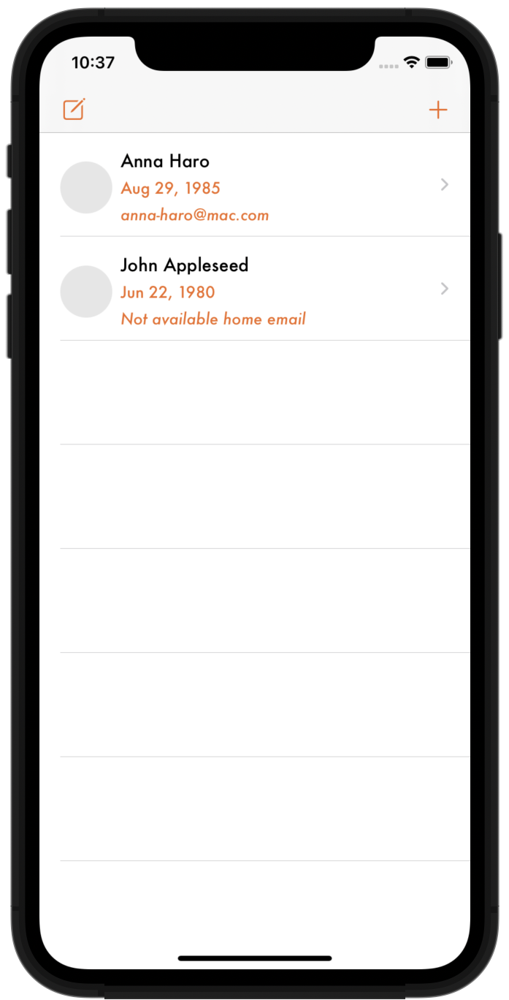

# Swifts-30-Projects - 23

주소록을 추가할 수 있고, 리스트에 주소록에 사람들의 생일을 등록해 볼 수 있는 앱이다. 

`Contacts` / `contactsUI` 모듈을 사용한다.

## Storyboard

홈 화면 `UITableView`에서의 `cell`은 `ContactBirthdayCell.xib` 에서 Interface Builder를 통해 구현되어 있다. 

## AppDelegate

### func requestForAccess(completionHandler: @escaping (_ accessGranted: Bool) -> Void)

연락처를 관리하는 `CNContactStore` 클래스를 이용해 주소록의 접근 허용 여부를 확인하고,

접근이 거부된 상태일 때, 다시 요청하고, 인자로 받은 completionHandler 를 호출한다. 한번 더 거부 되었을 때에는 에러 메시지를 출력한다. 에러 메시지는 alerview 를 표시하는 `Helper` 클래스를 이용한다.

## ViewController

홈 화면인 `ViewController`다. 

주소록에 대한 정보는 `CNContact` 의 배열로 이루어져 있다. 해당 변수는 해당 화면 내부 `tableView` 에서 `dataSource`로 사용된다.

### func configureTableView()

tableView를 설정하는 함수이다. `delegate`, `dataSource` 를 할당하고, custom cell (nib) 을 등록한다.

### override func prepare(for segue: UIStoryboardSegue, sender: Any?)

해당 함수는 `storyboard` 에서 `segue` 를 통해서 지정해둔 화면 전환을 수행하기 이전에 호출된다.

어떤 화면의 전환이든 해당 함수가 호출되기 때문에 `segue.identifier` 를 이용해 어떠한 전환인지 확인하고 전환을 수행한다.

해당 함수에서는 `AddContactViewController.delegate`를 할당한다.

### func tableView(_ tableView: UITableView, cellForRowAt indexPath: IndexPath) -> UITableViewCell

각 `IndexPath`에 해당하는 cell을 표시할 때에 호출된다.

먼저 해당 cell에 표시할 `CNContact` 객체에서 birthday, image, email 속성을 가져올 수 있는지 확인하고 불가능 할때에 `refetch` 함수를 호출해 다시 속성을 가져오도록 시도한다.

연락처 속성 정보를 cell의 이미지나 텍스트로 할당하고, cell을 반환한다.

### fileprivate func refetch(contact: CNContact, atIndexPath indexPath: IndexPath)

주소록에서 데이터를 다시 가져오기 위해 호출되는 함수이다.

`AppDelegate`에서 정의한 `requestForAccess` 함수를 호출해 주소록 접근 권한을 확인하고,

주소록을 `CNContactStore` 인스턴스를 이용해 받아온다. 이후 해당 클래스의 `contacts` 배열에 저장하고, tableView 를 리로드한다.

### func tableView(_ tableView: UITableView, commit editingStyle: UITableViewCell.EditingStyle, forRowAt indexPath: IndexPath)

`UITableViewDelegate` 내부에 정의되어 있는 함수이다. editing event가 일어났을 때 해당 함수가 호출된다. 

delete 일때, `conatcts` 배열에서 해당 연락처를 삭제하고 tableView를 리로드한다.

### func tableView(_ tableView: UITableView, didSelectRowAt indexPath: IndexPath)

셀을 선택했을 때 호출되는 함수이다.

해당 셀에 해당하는 연락처 인스턴스에 필요한 key들이 존재하는지 확인하고, `CNContactViewController`를 이용해 연락처 정보 화면을 표시한다.

연락처의 권한이 없으면 다시 연락처 권한을 시도하고, 연락처 화면 정보를 표시한다.

### func didFetchContacts(_ contacts: [CNContact])

`AddContactViewControllerDelegate` 프로토콜을 채택해 정의한 함수이다. `ViewController` 클래스의 `contacts` 배열에 해당 연락처를 추가하고, tableView를 리로드한다.

## CreateContactViewController

홈 화면에서 왼쪽 상단 `navigationItem`을 선택하면 전환되는 화면이다.

`UIViewController`를 상속 받아 구현하였다. 

이름 / 성 / 이메일 / 생일 을 입력하는 textField / datePicker가 존재한다.

오른쪽 상단 navigationItem으로 저장 버튼이 존재하고, 탭 하면 `createContact` 함수가 호출된다.

### @objc func createContact()

연락처를 생성하는 함수이다.

`CNMutableContact` 인스턴스를 생성하고, 각 textField, datePicker에 정보를 가져와 `CNSaveRequest.add(_:toContainerWithIdentifier:)` 함수로 주소록에 연락처를 저장한다.

마지막에 적용할 때에는 `CNContactStore.excute(_:)` 를 호출하여야 한다.

실패할 때에는 `Helper` 클래스를 이용해 실패 메시지를 띄운다.

## AddContactViewController

홈 화면에서 우측 상단 navigationItem 을 선택시 전환되는 씬이다.

성을 입력 받는 TextField 하나, 월을 선택하는 PickerView가 존재한다.

우측 상단 navigationItem 에 완료 버튼을 추가한다.

### @IBAction func showContacts(_ sender: AnyObject)

화면 아래 'Open contacts to select' 버튼을 탭 했을 때 호출된다.

연락처 선택 화면을 표시할 수 있는 `CNContactPickerViewController`  인스턴스를 생성해 해당 화면을 표시한다. 

### func contactPicker(picker: CNContactPickerViewController, didSelectContact contact: CNContact)

(함수 이름이 func contactPicker(_ picker: CNContactPickerViewController, didSelect contact: CNContact) 로 변경되었음.)

`CNContactPickerViewController` 화면에서 연락처를 선택했을 때에 호출되는 함수이다.

`delegate.didFetchContacts(_:)` 함수를 호출해 연락처 속성을 다시 가져오도록 하고, 해당 화면을 닫는다.

### func pickerView(_ pickerView: UIPickerView, titleForRow row: Int, forComponent component: Int) -> String?

`UIPickerViewDelegate` 프로토콜에 원형이 존재하는 함수이다.

`pickerView`에서 해당 row의 문자열을 반환한다. 문자열 목록은 months 배열에 존재한다.

### func pickerView(_ pickerView: UIPickerView, didSelectRow row: Int, inComponent component: Int)

`pickerView` 에서 해당 row를 선택했을 때에 호출되는 함수이다. 

index 를 이용해 선택한 달을 얻는다.

### func textFieldShouldReturn(_ textField: UITextField) -> Bool

textField edit 후에 return 했을 때 호출되는 함수이다.

`requestForAccess` 함수를 이용해 주소록 접근 권한을 확인하고, 이름에 해당하는 주소록을 찾기 위해 `predicate`를 생성한다.

생성된 `predicate`를 이용해 주소록 찾기를 시도하고, 실패 시 (혹은, 일치하는 결과가 없을 때) 에러메시지를 `Helper` 클래스를 통해 표시한다. 

정상적으로 찾았다면, `delegate.didFetchContacts(_:)` 함수를 호출하고, 해당 `viewController`를 닫는다.

주소록을 찾으면 속성들(이름, 이메일, 생일)을 가져온다. 

### @objc func performDoneItemTap()

'done' navigationItem 을 선택했을 때 호출되는 함수이다.

이용해 각 key들에 해당하는 속성들을 불러오고, 불러온 연락처들 중, 생일 월이 일치하는 연락처를 contacts 배열에 추가한다.

`delegate.didFetchContatcts(_:)` 함수를 호출해 fetch 작업이 끝났을때 동작을 수행한다.

## Helper

### static func show(message: String)

인자로 받은 문자열을 `UIAlertController`를 통해 화면에 표시하는 함수이다. 

버튼은 dissmiss 에 해당하는 action 하나 존재한다.

## extension DateCompoenets

날짜 / 시간을 다룰때 사용되는 구조체이다.

`var asString: String?`

`DateFormatter`를 이용해 날짜를 문자열로 변환해 출력한다.