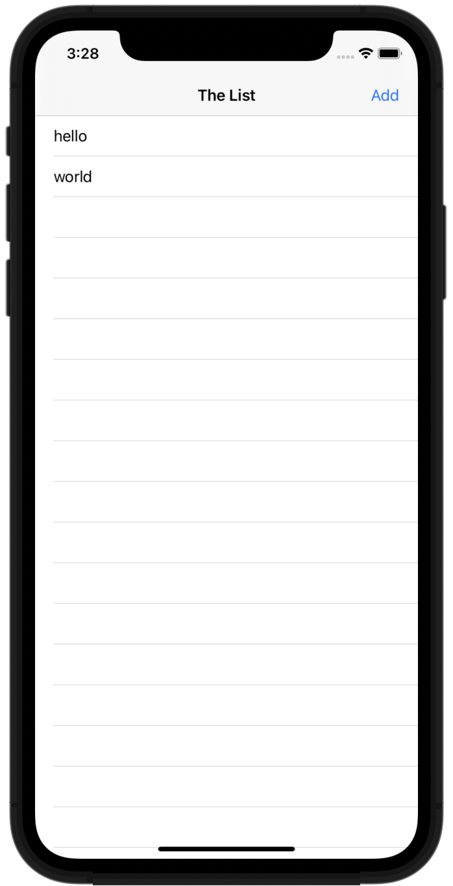

# Swifts-30-Projects - 24

Core Data 를 이용해 데이터를 저장하는 어플리케이션이다.

테이블뷰 하나로 이루어진 화면이 하나 존재하고, 오른쪽 상단 navigation Item 이 하나 존재한다.

해당 아이템을 선택하면, `UIAlertController`가 표시되고, `textField`에 입력후 save 를 누르면 테이블 뷰에 추가가 된다. 해당 데이터는 Core Data에 저장되기 때문에, 삭제되지 않고 유지된다.

셀을 슬라이드 하여 데이터를 지울 수 있다. 

## Storyboard

## HitList.xcdatamodeld

Person Entity가 하나 존재하고, 해당 entity에는 name 속성이 하나 존재한다. 

## AppDelegate

Core Data 사용 시에 필요한 기능들이 구현되어 있다. 최근 Xcode 에서는 프로젝트 생성 시에 Core Data 사용을 체크하면 해당 코드를 자동으로 생성할 수 있다. 

작업을 마치고 저장할 때에는 `saveContext()` 함수를 호출에 데이터를 저장한다.

## ViewController

테이블 뷰가 하나 포함되는 `UIViewController`이다. 각 셀에 대한 정보는 people 배열에 담기고, 

### func fetchCoreData(_ managedContext: NSManagedObjectContext)

core data 를 불러온다. 불러오는 데이터는 `NSFetchRequest` 클래스를 이용해서 Request 인스턴스를 생성한다. 

먼저 `NSManagedObjectContext` 인스턴스를 매개변수로 받아, managedContext.fetch 를 호출해 entity를 가져오도록 한다. 

### func tableView(_ tableView: UITableView, cellForRowAt indexPath: IndexPath) -> UITableViewCell

`UITableviewDataSource` 프로토콜을 채택해 구현한 함수이다. 

`tableView.dequeueReusableCell` 함수를 이용해 셀을 가져오고, 배열에서 indexPath.row에 해당하는 값을 가져와 `cell.textLabel`에 설정한다. 

### func tableView(_ tableView: UITableView, commit editingStyle: UITableViewCell.EditingStyle, forRowAt indexPath: IndexPath)

특정 셀을 삭제하려고 할때 호출되는 함수이다.

인자로 받은 `editingStyle`에 따라 다른 동작이 수행되는데, `.delete` 일 때에 삭제 동작을 수행한다.

`AppDelegate`에 구현되어 있는 함수를 통해 `NSManagedObjectContext` 인스턴스를 가져오고, delete 명령을 수행해 해당 셀에 사용되는 `NSManagedObject` 인스턴스를 삭제한다. `NSManagedObject.save()` 함수를 호출해 변경 내역 저장을 시도한다.

### @IBAction func addName(_ sender: AnyObject)

오른쪽 상단 `add` navigation Item 을 터치했을때 호출되는 함수이다. 

UIAlertcontroller를 이용해서 alert view를 표시한다. 해당 화면에서는 textField가 하나 존재하고, save / cancel 버튼이 존재한다. save 를 선택 시에 textField 의 텍스트를 `saveName(_:)` 함수를 이용해 저장한다.

### func saveName(_ name: String)

이름을 저장하는 함수이다.  `NSManagedObjectContext` 인스턴스를 이용해 Person entity(`NSManagedObject`)를 생성하고, 값을 추가하고, 저장내역 변경을 시도한다. 배열에도 동일한 데이터를 추가한다.