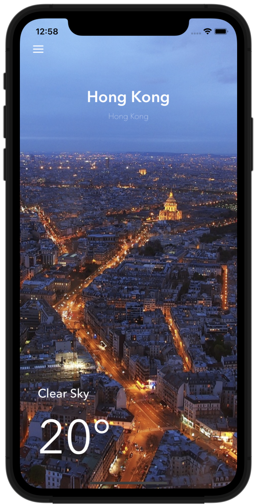

# Swifts-30-Projects - 25

WeatherDemo / WeatherKit / Weather Widget 세가지의 디렉터리가 존재한다.

WeatherKit은 날씨를 받아오는 기능을 모듈로써 분리하였고, 앱은 WeatherDemo 이다.

Weather Widget 으로 위젯을 추가할 수 있다.

WeatherKit을 모듈로 분리함으로써 위젯과 앱 두곳에서 모두 같은 기능을 사용할 수 있다.

## ViewController

### func displayCurrentWeather()

현재 날씨를 표시하는 함수이다.

선택된 국가 / 도시 UILabel 의 텍스트를 변경한다.

`WeatherKit` 모듈에 포함되어있는 `WeatherService` 클래스를 이용해 현재 날씨를 얻어온다. completion handler 로 날씨 / 기온을 나타내는 텍스트를 수정한다.

### @IBAction func unwindToHome(_ segue: UIStoryboardSegue)

`ViewController` 가 아닌, `LocationTableViewController` 와 연결되어있는 @IBAction 함수이다. 구현된 내용은 없다.

### @IBAction func updateWeatherInfo(_ segue: UIStoryboardSegue)

`ViewController` 가 아닌, `LocationTableViewController` 와 연결되어있는 @IBAction 함수이다.

`segue.source`로 `LocationTableViewController` 의 데이터를 받아온다.

선택된 주소 정보를 받아오고, 콤마를 기준으로 문자열을 잘라 현재 클래스의 `city` / `country` 프로퍼티에 저장한다. 

이후, `displayCurrentWeather` 함수를 호출하여 날씨 정보를 갱신한다.

### override func prepare(for segue: UIStoryboardSegue, sender: Any?)

Interface Builder 에서 설정한 segue를 통해서 화면 전환이 이루어질 때 호출된다.

segue.identifier 로 어떤 segue 인지 식별하며, 전환되는 `LocationTableViewController` 에 `selectionLocation`을 지정한다.

## LocationTableViewController

modally 하게 도시를 선택하는 씬이다. `UITableViewController`를 상속받아 구현하였다.

tableView DataSource 로 `locations` 배열을 사용했다. 

### override func tableView(_ tableView: UITableView, cellForRowAt indexPath: IndexPath) -> UITableViewCell

`locations` 프로퍼티에서 인덱스에 해당하는 값을 가져와 `UILabel`을 설정한다.

`selectedLocation`과 일치하는 값에 chekmark accessory 를 표시한다.

### override func tableView(_ tableView: UITableView, didSelectRowAt indexPath: IndexPath)

선택된 셀에 accessory type을 지정하고, `selectedLocation`에 해당 셀 값을 지정한다.

---

# Weather Widget

## TodayViewController

위젯을 표시하는 뷰 컨트롤러이다. `UIViewController`, `NCWidgetProviding` 두가지를 채택하고 있다.

( `NCWidgetProviding` 은 WidgetKit으로 대체되었다. )

### func displayCurrentWeather()

WeatherDemo 의 `ViewController.displayCurrentWeather` 과 동일하다.  WeatherService를 이용해 날씨 정보를 받아오고, 위젯의 label을 수정한다..

### func widgetPerformUpdate(completionHandler: (@escaping (NCUpdateResult) -> Void))

`NCWidgetProviding` 에 원형이 존재한다. 위젯을 업데이트할때 호출되는 함수이다.

fetching이 되었으면, 새로운 데이터로 업데이트한다.