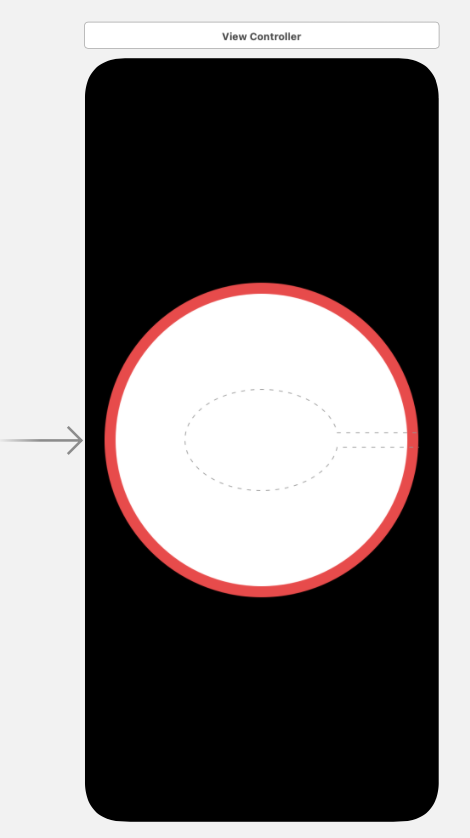

# Swifts-30-Projects - 26

3D 터치 기능을 이용해 무게를 측정할 수 있는 프로그램이다.

## Storyboard

## ViewController

### override func touchesMoved(_ touches: Set<UITouch>, with event: UIEvent?)

`UIResponder`에 정의되어 있는 함수이다. 터치 이벤트가 발생 되었을 때에 호출된다. 

`traitCollection.forceTouchCapability` 을 이용해 3D 터치 가능 여부를 확인한다.

touch.force 값으로 무게를 계산하여 `UILabel`을 수정한다.

`traitCollection`은 디바이스의 사이즈 / 레이아웃 방향 / 디스플레이 감마 / 3D 터치 등 기기의 속성에 대한 정보를 포함하고 있다. 

### override func touchesEnded(_ touches: Set<UITouch>, with event: UIEvent?)

`UIResponder` 에 정의되어 있는 함수이다. 터치 이벤트가 종료 되었을 때에 호출된다.

`UILabel`을 0g으로 수정한다.