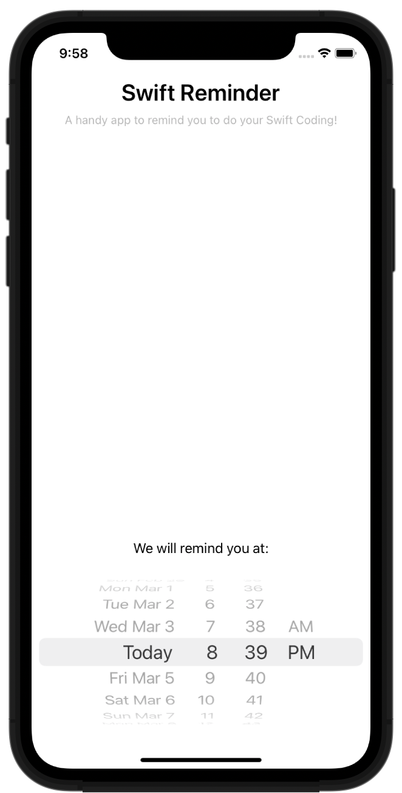

# Swifts-30-Projects - 27



화면에 표시된 DatePickerView에 지정된 시각을 설정해 두면 해당 시각에 맞추어 Push Notification을 생성하는 앱이다.

## Storyboard


하나의 화면에 datepicker 하나 존재한다.


## AppDelegate

### func application(_:,didFinishLaunchingWithOptions:) -> Bool

애플리케이션 Launch가 끝났을 때에 호출되는 함수이다.

사용자에게 UserNotification 사용에 대한 권한을 요청한다. `UNUserNotificationCenter.requestAuthorization` 함수를 통해 권한을 승인 받는다. 

`UNNotificationAction`, `UNNotificationCategory` 인스턴스를 생성한다. 

`UNNotificationAction` 은 알림을 Notification 에 응답하는 작업에 사용된다. 

identifier로 구분하고, title이 버튼의 title이다. 

생성된 action들은 `UNNotificationCategory` 에 등록하고, 이것을 `UNUserNotificationCenter.setNotificationCategories(_:)` 로 등록한다.

```swift
let action = UNNotificationAction(identifier: "remindLater", title: "Remind me later", options: [])
    let category = UNNotificationCategory(identifier: "normal", actions: [action], intentIdentifiers: [], options: [])
    UNUserNotificationCenter.current().setNotificationCategories([category])
```

### func scheduleNotification(at date: Date)

새로운 노티피케이션을 생성해 `UNUserNotificationCenter`에 등록하는 함수이다. 

Notification 알림 시점은 `UNCalendarNotificationTrigger` 인스턴스에 담긴다. `Calendar` 클래스 및  `DateComponents` 클래스를 이용해서 `UNNotificationTrigger` 를 상속받아 구현한 `UNCalendarNotificationTrigger` 생성의 인자로 사용한다.

알림에 대한 정보는 `UNMutableNotificationContent` 클래스에 담긴다. 

`title`, `body`, `sound` 프로퍼티를 채운다. `categoryIdentifier` 프로퍼티에는 사용되는 `UNNotificationCategory.identifier` 와 동일한 문자열을 사용한다. 

Bundle을 이용해 이미지 파일을 가져오고, UNNotificationAttachment 클래스에 이것을 담아 `UNMutableNotificationContent.attachments` 에 추가한다. 

`UNNotificationRequest` 클래스에는 trigger, content가 담긴다. 

인스턴스를 생성 하고, `UNUserNotificatoinCenter.add(_:)` 함수를 이용해 해당 인스턴스를 추가한다.

## extension AppDelegate: UNUserNotificationCenterDelegate

notification 관련 액션을 구현하는데에 쓰인다. 

### func userNotificationCenter(_ :,response:,withCompletionHandler:)

notification에서 action을 선택했을 때 해당 함수가 호출된다. 사진 중 오른쪽 사진 "Remind me later" 버튼을 선택시에 호출된다.

response 매개변수에 해당 응답이 포함되어 있다. `reponse.actionIdentifier`를 이용해 어떤 액션인지 확인하고, "remindLater" 이였으므로, 현재 시각의 1분 뒤의 시점으로 notification을 등록한다.

## ViewController

### @IBAction func datePickerDidSelectNewDate(_ sender: UIDatePicker)

datepicker에서 날짜 선택이 완료 되었을 때에 호출된다.

선택한 시각을 매개변수로 `scheduleNotification` 함수를 호출한다.

## Notification 관련 클래스 요약

- `UNUserNotificationCenter` : 알림 권한 획득. 해당 애플리케이션에서 사용하는 모든 알림을 관리
- `UNNotificationAction` : Notification에서 동작하는 action 의 title, identifier, 동작 option 포함.
기능은 `userNotificationCenter(_:didReceive:withCompletionHandler:)` 함수에 구현함.
- `UNNotificationCategory` : 애플리케이션의 Notification의 종류를 포함 (여러 종류의 알림이 있을 수 있으니)
- `UNNotificationTrigger` : Notification이 언제 발생하는지 시점을 포함하고 있다.
- `UNMutableNotificationContent` : Notification에 표시되는 내용들을 포함하고 있다.
- `UNNotificationRequest` : `UNNotificationTrigger` + `UNMutableNotificationContent`, identifier