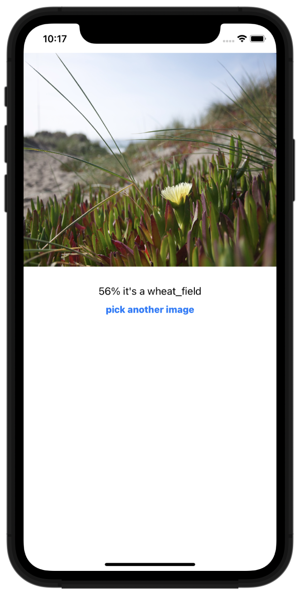

# Swifts-30-Projects - 28

Core ML 을 이용해서 이미지를 인식하는 애플리케이션이다.

## ViewController

### @IBAction func pickImage(_ sender: Any)

pickImage 라고 적힌 버튼을 선택할 때에 호출된다. 

`UIImagePickerController`를 이용해 사진 선택 화면을 표시한다.

`UIImagePickerController` 는 `UIImagePickerControllerDelegate`, `UINavigationControllerDelegate` 두개의 Delegate가 필요하다.

delegate 를 지정하고, picker 화면을 표시한다.

## extension ViewController: UIImagePickerControllerDelegate

### func imagePickerController(_:,didFinishPickingMediaWithInfo:)

imagePickerController에서 미디어 선택이 완료 되었을 때에 호출된다. 

info에서 선택한 이미지를 얻어내고, 해당 이미지를 이용해 ML 모델로 처리하는 `detectScene` 함수를 호출한다.

### func detectScene(image: CIImage)

CoreMLModel을 이용해서 이미지를 검출하는 함수이다. Vision 모듈에 `VNCoreMLModel` 클래스를 이용해 `GoogLeNetPlaces` 모델을 가져온다. 

모델을 이용해 `VNCoreMLRequest` 인스턴스를 생성한다. 생성자 단계에서, 어떤 모델을 사용하는지, 결과물을 어떻게 처리하는지, `model` 과 `completionHandler` 를 지정한다.

여기에서 model은 이전에 생성한 `VNCoreMLModel` 인스턴스이고, `completionHandler`는 

결과물을 이용해 화면 내의 UILabel.text 를 변경하는 클로저이다. 

처리할 이미지를 포함한 `VNImageRequestHandler` 인스턴스를 생성하고,

`VNImageRequestHandler.perform` 을 호출해 요청들을 모두 처리한다. 

데이터 처리는 main이 아닌 다른 쓰레드에서 처리한다.

## CoreML 도움

`VNCoreMLModel` :

`MLModel` 을 인자로 받는 컨테이너 역할의 클래스

`VNCoreMLRequest` : model + completionHandler

어떤 모델을 이용해서 동작할지, 해당 모델을 적용해서 처리한 후에 동작할 `completionHandler` 지정한다.

`VNImageRequestHandler` : `CIImage`, pefrom (with `VNCoreMLRequest` )

request 를 이용해서 지정. `VNImageRequestHandler.perform(_:)` 를 호출 시에 `init(ciImage:)` 에서 인자로 받은 `CIImage` 인스턴스를 perfrom 함수의 파라미터인 `VNCoreMLRequest` 로 처리한다.

`VNClassificationObservation` :

예측 / 분류 결과를 담는 클래스. `VNCoreMLRequest` 를 이용해 처리된 결과이다.